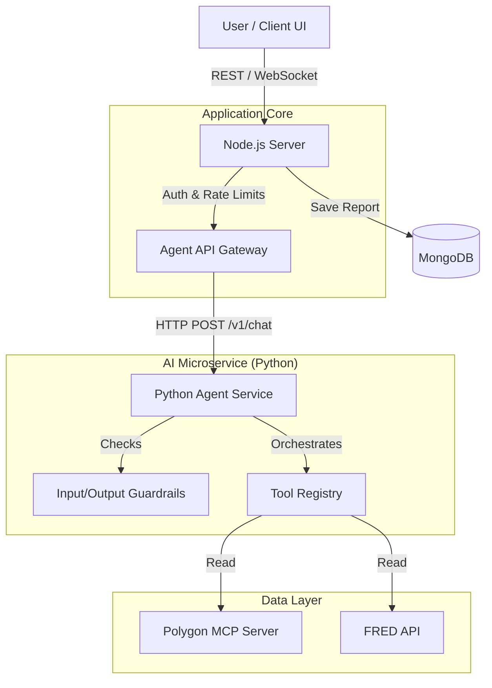

# Agent Architecture Specification

This document details the architectural design of the "Financial Analysis Agent," a dedicated Python microservice providing natural language market intelligence to the trading platform.

## 1. System Context

The Agent operates as a stateless sidecar to the main Node.js backend, communicating via REST (FastAPI). It enables natural language interaction by orchestrating tools from the underlying MCP (Model Context Protocol) server.

## 2. Component Interactions

### A. Node.js Server (Orchestrator)
- **Role**: API Gateway & Session Manager.
- **Responsibilities**:
  - Handles user authentication.
  - Rate-limits AI requests (e.g., max 50 daily calls).
  - Maintains conversation history in memory (or database) and passes context to the stateless agent.
  - **Key Routes**:
    - `POST /api/chat`: Main entry point for user chat.
    - `POST /api/analyze`: Trigger for automated background analysis.

### B. Python Agent (Intelligence Layer)
- **Role**: Stateless Reasoning Engine.
- **Stack**: FastAPI, OpenAI Agents SDK (Pydantic AI pattern), Uvicorn.
- **Key File**: `agent/core/polygon_agent.py`.
- **Responsibilities**:
  - **Tool Orchestration**: Decides which Polygon/FRED tools to call based on user query.
  - **Guardrails**:
    - *Input*: Rejects non-financial queries (e.g., "Write a poem").
    - *Output*: Enforces specific formatting (Summary -> Bullets -> Conclusion).
  - **Formatting**: Returns markdown-formatted responses optimized for the React client.

### C. Tools & MCP (Data Access)
- **Role**: Deterministic Data Fetchers.
- **Components**:
  - **Native Tools**: Functions defined in `polygon_agent.py` (e.g., `save_analysis_report`).
  - **MCP Integration**: Uses Model Context Protocol to standardize tool definitions for Polygon.io data (Aggregates, Option Chains, News).
  - **Future Extensions**: Designed to accept new tool providers (e.g., Futures Data Fetcher) without rewriting the core agent loop.

## 3. Data Flow

### Scenario: User asks "How is SPY vol looking?"

1.  **Client**: Sends `POST /api/chat` with message "How is SPY vol looking?" and current dashboard context (symbol: SPY, timeframe: 5m).
2.  **Node.js**:
    - Checks rate limits.
    - Appends simplified conversation history.
    - Forwards request to `http://localhost:5001/v1/chat/completions`.
3.  **Python Agent**:
    - **Guardrail**: Verifies query is finance-related ("Yes").
    - **Planner**: Identifies need for `get_polygon_options_snapshot` (for IV) and `get_polygon_ticker_sentiment`.
    - **Execution**: Calls tools in parallel/sequence.
    - **Synthesis**: Combines tool outputs into the standard "Summary/Bullets/Conclusion" format.
4.  **Node.js**: Receives markdown response and streams/returns it to the Client.
5.  **Client**: Renders the markdown response.

## 4. Extensibility & Future Work

### Adding Futures Support
To support futures (which Polygon.io lacks), we do not need to change the architecture. We simply add a new **Tool**:
1.  Define `get_futures_data(symbol)` in `agent/core/polygon_agent.py`.
2.  Register it in the `tools` list.
3.  The Agent will automatically learn to use it when users ask about "ES" or "Oil futures" via the system prompt.

### Lab Integration
To allow the agent to "save strategies" to the Lab:
1.  Add a `create_strategy_in_lab` tool.
2.  This tool sends a callback or direct DB write (if safe) to create a record in the `strategies` collection.
