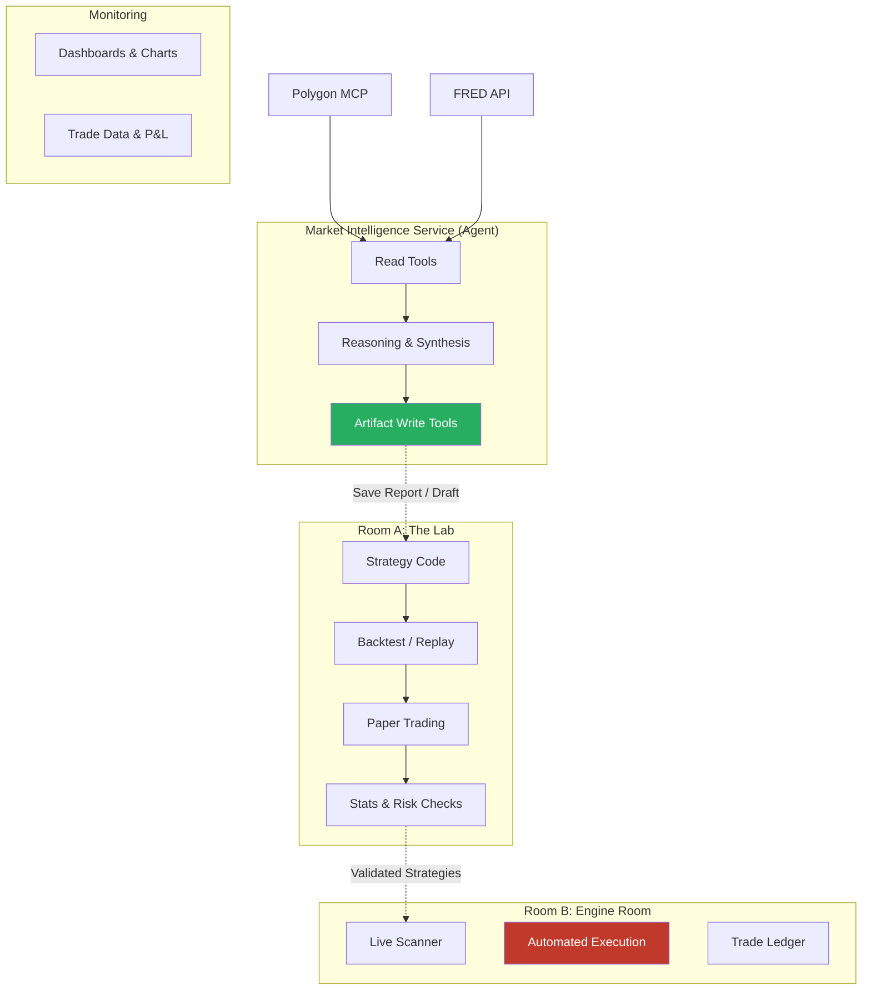

# Lab Agent Integration Specification

**Goal**: Integrate the Financial Analysis Agent into "The Lab" to act as an AI co-pilot for strategy development, backtesting, paper trading, and risk validation.

> [!CAUTION]
> **Perimeter Rule**: The agent is **OUTSIDE** the System Perimeter. It interacts inside the Lab (Room A) using **read-only** data access and **artifact creation** (reports/drafts). It **CANNOT** execute live trades or promote strategies to the Engine Room (Room B) without explicit human action.

---

## 1. Architecture Overview

The uploaded diagram illustrates the perimeter enforcement:


### Data Flow



---

## 2. Phase-by-Phase Capabilities

### Phase 1: Strategy Code Development

**Agent Capabilities**:
- **Code Generation**: Natural language → Python trading strategy.
- **Code Review**: Bug detection, best practices, performance optimization.
- **Documentation**: Auto-generate `strategy.md`, parameter explanations.

**New Tools**:
| Tool | Signature | Description |
|------|-----------|-------------|
| `analyze_strategy_code` | `(code: str) -> str` | Suggestions for improvements, bugs, or performance issues. |
| `generate_strategy_code` | `(description: str, language: str = 'python') -> str` | Generates code from natural language. |
| `explain_strategy_code` | `(code: str) -> str` | Plain English explanation of strategy logic. |

---

### Phase 2: Backtest & Replay

**Agent Capabilities**:
- **Parameter Optimization**: Design efficient parameter sweeps, sensitivity analysis.
- **Performance Decomposition**: Win/loss by time of day, regime, slippage impact.
- **Comparative Analysis**: Benchmark comparisons, variant A/B/C analysis.

**New Tools**:
| Tool | Signature | Description |
|------|-----------|-------------|
| `get_backtest_results` | `(backtest_id: str) -> dict` | Fetch raw metrics from Lab DB. |
| `analyze_backtest_results` | `(backtest_id: str) -> str` | Insights on drawdowns, win rate, etc. |
| `compare_backtests` | `(backtest_ids: List[str]) -> str` | A/B testing analysis across variants. |

---

### Phase 3: Paper Trading

**Agent Capabilities**:
- **Live Monitoring**: Alert on unusual behavior, deviation from backtest.
- **Behavioral Analysis**: Expectation vs. reality, slippage analysis.
- **Readiness Assessment**: Confidence scoring (0-100), promotion checklist.

**New Tools**:
| Tool | Signature | Description |
|------|-----------|-------------|
| `get_paper_trading_results` | `(strategy_id: str) -> dict` | Fetch live simulation stats. |
| `monitor_paper_trading` | `(strategy_id: str) -> str` | Summary of performance vs. expectations. |

---

### Phase 4: Stats & Risk Checks

**Agent Capabilities**:
- **Statistical Validation**: Monte Carlo, out-of-sample testing, overfitting detection.
- **Risk Metrics**: VaR, CVaR, max drawdown, concentration risk.
- **Production Readiness**: Failure mode analysis, circuit breaker tuning.

**New Tools**:
| Tool | Signature | Description |
|------|-----------|-------------|
| `compute_risk_metrics` | `(strategy_id: str, backtest_id: Optional[str]) -> dict` | VaR, Sharpe, MaxDD. |
| `explain_risk_metrics` | `(metrics: dict) -> str` | Qualitative risk assessment. |

---

### Artifact Tools (Write Access)

| Tool | Signature | Description |
|------|-----------|-------------|
| `save_analysis_report` | `(content: str, title: str) -> str` | Save markdown report to Lab. Returns report ID. |
| `create_strategy_draft` | `(code: str, description: str, parameters: dict) -> str` | Save new strategy candidate. Returns draft ID. |

---

## 3. Critical Blind Spots & Mitigations

### 3.1 Feedback Loop Problem
**Risk**: Agent remains static while market evolves.

**Solution**: Outcome Annotation System
```python
{
    "suggestion_id": "sug_20260116_001",
    "agent_suggestion": "Increase stop loss from 2% to 3%",
    "human_decision": "Implemented",
    "outcome_metrics": {"sharpe_before": 1.2, "sharpe_after": 1.4},
    "learned_pattern": "Larger stops improved risk-adjusted returns"
}
```

---

### 3.2 Explainability Problem
**Risk**: Agent is a black box; regulators need reasoning.

**Solution**: Structured Reasoning Logs
```python
{
    "suggestion": "Reduce position size by 40% during Fed announcements",
    "evidence_chain": [
        {"source": "historical_data", "finding": "Volatility spikes 220% on average"},
        {"source": "similar_strategies", "finding": "12/15 momentum strategies overfit to calm periods"}
    ],
    "confidence_score": 0.87
}
```

---

### 3.3 Model Drift Problem
**Risk**: Market regime changes invalidate agent's training data.

**Solution**: Regime Context Injection
- Inject current VIX, Fed policy, analog periods into every agent request.
- Instruction: "Base analysis on CURRENT regime, not historical averages."

---

### 3.4 Data Poisoning Problem
**Risk**: Agent trusts buggy/stale data.

**Solution**: Data Sanity Layer
- Validate all inputs before agent sees them (price spikes, volume anomalies, Sharpe plausibility).
- Flag anomalies and adjust confidence accordingly.

---

### 3.5 Clever Hans Problem
**Risk**: Agent learns spurious correlations (e.g., "filenames with `_v2` get approved").

**Solution**: Counterfactual Testing
- Periodically test agent reasoning by shuffling dates, adding noise, reversing labels.
- Flag fragile suggestions.

---

## 4. Agent Health Dashboard

Monitor the monitor:

| Metric | Description |
|--------|-------------|
| `suggestions_made` | Total suggestions generated |
| `suggestions_implemented` | How many traders followed |
| `implemented_success_rate` | % that improved metrics |
| `top_performing_suggestion_types` | Which suggestions work best |
| `worst_performing_suggestion_types` | Which need fine-tuning |

---

## 5. Ethical Boundaries

```python
ETHICAL_BOUNDARIES = {
    "responsibility": "Trader retains 100% accountability",
    "delegation_limits": "Max 30% of daily decisions can be agent-suggested",
    "transparency": "All investor reports disclose AI usage %",
    "kill_switch_triggers": [
        "Accuracy < 40% for 5 days",
        "Latency P99 > 10s",
        "Data anomaly rate > 5%",
        "Regulator inquiry"
    ]
}
```

---

## 6. Implementation Roadmap

| Week | Focus | Tools |
|------|-------|-------|
| 1-2 | Code Assistant | `generate_strategy_code`, `analyze_strategy_code`, `explain_strategy_code` |
| 3-4 | Backtest Analyst | `get_backtest_results`, `analyze_backtest_results`, `compare_backtests` |
| 5-6 | Paper Monitor | `get_paper_trading_results`, `monitor_paper_trading` |
| 7-8 | Risk Quant | `compute_risk_metrics`, `explain_risk_metrics` |

---

## 7. Key Principles

1. **Agent as Citizen, Not Overlord**: Suggests, never decides.
2. **Traceability**: Every action logged with rationale.
3. **Perimeter Enforcement**: Read-only on live data; Write-only on artifacts. **No execution.**
4. **Continuous Learning**: Feedback loop improves future suggestions.

---

## Related Documents

- [USER_FLOW_SPECIFICATION.md](./USER_FLOW_SPECIFICATION.md) - Complete user journey from ideation to live trading
- [SCHEMA_SPECIFICATION.md](./SCHEMA_SPECIFICATION.md) - Database schemas for all system components
- [AGENT_ARCHITECTURE.md](./AGENT_ARCHITECTURE.md) - Technical architecture of the agent system
