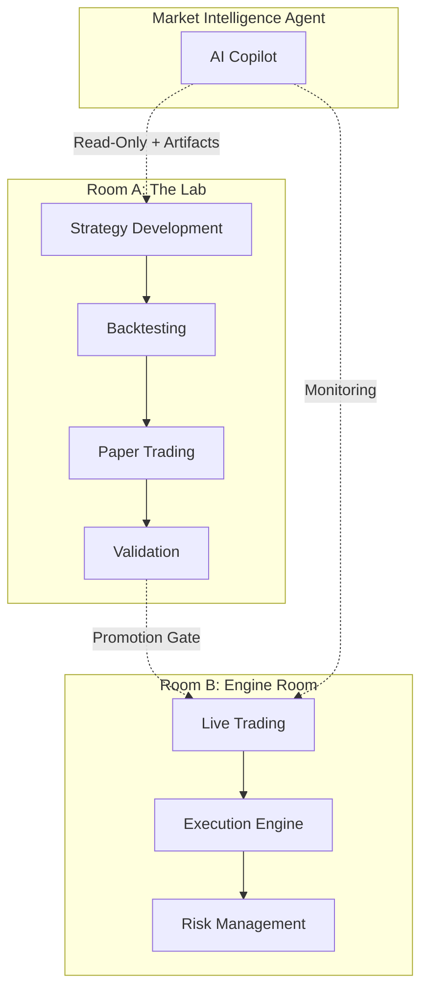

# Trading Platform User Flow Specification

**Goal**: Define the complete user journey for the trading platform, covering the strategy lifecycle from ideation to live trading with Lab (Room A) and Engine Room (Room B) integration.

> [!IMPORTANT]
> This document complements [LAB_AGENT_INTEGRATION.md](./LAB_AGENT_INTEGRATION.md) and [SCHEMA_SPECIFICATION.md](./SCHEMA_SPECIFICATION.md). The agent operates **OUTSIDE** the system perimeter with read-only data access and artifact creation only.

---

## System Architecture Overview



---

## User Roles & Personas

| Role | Primary Focus | Key Screens |
|------|--------------|-------------|
| **Quant/Researcher** | Strategy ideation, development, backtesting | Lab Dashboard, Strategy Editor, Backtest Results |
| **Trader** | Paper/live trading, execution quality | Paper Trading Monitor, Engine Room Dashboard |
| **Risk Manager** | Validation, promotion approval | Risk Review Panel, Promotion Gates |
| **Portfolio Manager** | Capital allocation | Allocation Dashboard, Performance Overview |

---

## Phase 1: Ideation & Strategy Formulation

**User**: Quant/Researcher

### Flow
1. **Idea Generation**: User conceives trading strategy (momentum, mean reversion, volatility)
2. **Market Research**: User queries agent for market intelligence
3. **Hypothesis Formulation**: User defines testable hypothesis
4. **Agent Assistance**: Agent provides insights from historical data

### Agent Integration Points
```
User: "What's the current term structure for VIX futures?"
Agent → Calls: get_aggregates("VIX", "day", 30)
Agent → Analyzes: Current contango/backwardation state
Agent → Suggests: "Consider short-volatility strategies in current regime"
```

### UI Wireframe: Research Interface
```
┌─────────────────────────────────────────────────────────────────────────┐
│  🔬 MARKET RESEARCH                                              [Save] │
├─────────────────────────────────────────────────────────────────────────┤
│  AGENT CHAT                                                             │
│  ────────────────────────────────────────────────────────────────────── │
│  You: "What are current volatility levels for SPY?"                     │
│                                                                         │
│  Agent: Current VIX at 22.5, slightly elevated. Term structure shows   │
│  contango of 6.2%. Historical analysis suggests mean reversion         │
│  strategies perform well in this regime.                               │
│                                                                         │
│  📊 Summary: VIX contango favorable for short-vol strategies           │
│  💡 Suggestion: Consider VXX short when contango > 5%                  │
│  ───────────────────────────────────────────────────────────────────── │
│  [Ask about strategy ideas...]                              [Send →]   │
└─────────────────────────────────────────────────────────────────────────┘
```

### Output
- Strategy hypothesis document (auto-generated by agent)
- Initial research notes saved to Lab

---

## Phase 2: Coding & Development

**User**: Quant/Developer

### Flow
1. **Template Selection**: Select strategy template or start from scratch
2. **Coding**: Write strategy in Python with agent assistance
3. **Code Review**: Agent reviews for errors, performance, compliance
4. **Documentation**: Agent auto-generates documentation

### Agent Tools
| Tool | Signature | Description |
|------|-----------|-------------|
| `generate_strategy_code` | `(description: str) -> str` | NL → Python code |
| `analyze_strategy_code` | `(code: str) -> str` | Bug detection, best practices |
| `explain_strategy_code` | `(code: str) -> str` | Plain English explanation |

### UI Wireframe: Strategy Editor
```
┌─────────────────────────────────────────────────────────────────────────┐
│  💻 STRATEGY EDITOR: VolArbitrage_v2                   [Save] [Run Test]│
├──────────────────────────────────┬──────────────────────────────────────┤
│  FILE EXPLORER          │ CODE  │  PARAMETERS                          │
│  ────────────────────── │       │  ──────────────────────────────────  │
│  📁 strategies/         │ 1│ cl │  📊 ENTRY                            │
│   └ 📄 volArb_v2.py ●   │ 2│    │  ┌────────────────────────────────┐  │
│  📁 tests/              │...│    │  │ contango_threshold    [0.07 ] │  │
│   └ 📄 test_volArb.py   │   │    │  │ lookback_period       [20   ] │  │
│                         │   │    │  └────────────────────────────────┘  │
│                         │   │    │                                      │
│                         │   │    │  ⚠️ RISK                             │
│                         │   │    │  ┌────────────────────────────────┐  │
│                         │   │    │  │ max_position_size     [0.02 ] │  │
│                         │   │    │  │ stop_loss_pct         [0.03 ] │  │
│                         │   │    │  └────────────────────────────────┘  │
├──────────────────────────────────┴──────────────────────────────────────┤
│  🤖 AGENT ASSISTANT                                                     │
│  ────────────────────────────────────────────────────────────────────── │
│  You: "How do I implement a trailing stop?"                             │
│                                                                         │
│  Agent: Based on your strategy, use 2x ATR trailing stop:              │
│  ```python                                                              │
│  def calculate_trailing_stop(self, current_price, atr):                │
│      return current_price - (2 * atr)                                  │
│  ```                                           [Insert Code] [Explain] │
└─────────────────────────────────────────────────────────────────────────┘
```

### Output
- Version-controlled strategy code in repository
- Auto-generated documentation

---

## Phase 3: Backtesting & Validation

**User**: Quant/Researcher

### Flow
1. **Backtest Configuration**: Set date range, initial capital, slippage model
2. **Running Backtest**: Execute strategy on historical data
3. **Agent Analysis**: Performance metrics, overfitting detection, sensitivity
4. **Iterative Optimization**: Adjust parameters, rerun tests

### Agent Tools
| Tool | Signature | Description |
|------|-----------|-------------|
| `get_backtest_results` | `(backtest_id: str) -> dict` | Fetch raw metrics |
| `analyze_backtest_results` | `(backtest_id: str) -> str` | Insight generation |
| `compare_backtests` | `(ids: List[str]) -> str` | A/B testing analysis |

### UI Wireframe: Backtest Results
```
┌─────────────────────────────────────────────────────────────────────────┐
│  📊 BACKTEST RESULTS: VolArbitrage_v2                    [Export] [Share]│
├─────────────────────────────────────────────────────────────────────────┤
│  PERFORMANCE SUMMARY                                                    │
│  ┌──────────────┐ ┌──────────────┐ ┌──────────────┐ ┌──────────────┐   │
│  │ TOTAL RETURN │ │ SHARPE RATIO │ │ MAX DRAWDOWN │ │   WIN RATE   │   │
│  │   +48.2%     │ │     1.42     │ │   -15.8%     │ │    58.2%     │   │
│  │   ▲ vs SPY   │ │   ✓ >1.0     │ │   ✓ <20%     │ │   ✓ >50%     │   │
│  └──────────────┘ └──────────────┘ └──────────────┘ └──────────────┘   │
├─────────────────────────────────────────────────────────────────────────┤
│  EQUITY CURVE                                          [1M][3M][1Y][All]│
│  ┌─────────────────────────────────────────────────────────────────────┐│
│  │         📈 Strategy ── SPY Benchmark                               ││
│  │    ╱╲                                                              ││
│  │   ╱  ╲    ╱──────                                                   ││
│  │  ╱    ╲──╱                                                          ││
│  │ ╱                                                                   ││
│  │╱──────────────────────────────────────────────────────────────────│ │
│  └─────────────────────────────────────────────────────────────────────┘│
├─────────────────────────────────────────────────────────────────────────┤
│  🤖 AGENT ANALYSIS                                                      │
│  ✓ Strategy shows consistent alpha across market regimes              │
│  ⚠ 80% of profits in Q4 - seasonality concern                         │
│  ⚠ Underperformance when VIX > 30 - consider regime filter            │
│  💡 Suggestion: Add Fed announcement filter to reduce drawdown         │
│                                                                         │
│  [View Detailed Metrics]  [Optimize Parameters]  [Start Paper Trading] │
└─────────────────────────────────────────────────────────────────────────┘
```

### Validation Tests
- Walk-forward analysis
- Monte Carlo simulation (10,000 paths)
- Regime-specific analysis
- Stress tests (COVID, 2008, flash crash)

### Output
- Validated strategy with backtest report
- Optimal parameter set
- Agent-generated validation summary

---

## Phase 4: Paper Trading

**User**: Quant/Trader

### Flow
1. **Paper Trade Setup**: Deploy to simulated live environment
2. **Live Monitoring**: Real-time comparison to backtest expectations
3. **Agent Analysis**: Slippage, fill rates, deviation alerts
4. **Readiness Assessment**: Generate promotion readiness score

### Agent Tools
| Tool | Signature | Description |
|------|-----------|-------------|
| `get_paper_trading_results` | `(strategy_id: str) -> dict` | Fetch live stats |
| `monitor_paper_trading` | `(strategy_id: str) -> str` | Performance vs expectations |

### UI Wireframe: Paper Trading Monitor
```
┌─────────────────────────────────────────────────────────────────────────┐
│  📝 PAPER TRADING: VolArbitrage_v2                    Day 12 of 15 ●    │
├─────────────────────────────────────────────────────────────────────────┤
│  LIVE METRICS                                                           │
│  ┌──────────────┐ ┌──────────────┐ ┌──────────────┐ ┌──────────────┐   │
│  │  TODAY P&L   │ │  WEEK P&L    │ │ TOTAL P&L    │ │  READINESS   │   │
│  │   +$1,842    │ │   +$4,523    │ │  +$12,450    │ │    82/100    │   │
│  │   +1.84%     │ │   +4.52%     │ │  +12.45%     │ │   ████████░░ │   │
│  └──────────────┘ └──────────────┘ └──────────────┘ └──────────────┘   │
├─────────────────────────────────────────────────────────────────────────┤
│  VS BACKTEST COMPARISON                                                 │
│  ┌─────────────────────────────────────────────────────────────────────┐│
│  │ Metric          Paper Trading    Backtest    Deviation             ││
│  │ Sharpe Ratio    1.38             1.42        -2.8% ✓               ││
│  │ Win Rate        62%              58%         +6.9% ✓               ││
│  │ Avg Slippage    1.2 bps          1.0 bps     +20% ✓                ││
│  └─────────────────────────────────────────────────────────────────────┘│
├─────────────────────────────────────────────────────────────────────────┤
│  🤖 AGENT MONITOR                                                       │
│  ● Live     "Market conditions favorable: contango at 6.5%"            │
│  ● 10:30    "Execution quality excellent: 0.8 bps slippage"            │
│  ⚠ 09:15    "VIX approaching threshold - monitoring closely"          │
│                                                                         │
│                          [Pause Trading]  [Request Promotion →]        │
└─────────────────────────────────────────────────────────────────────────┘
```

### Readiness Criteria
- Minimum paper trading period: 15 days
- Sharpe ratio consistency: > 1.0
- Maximum drawdown: < 5%
- Fill rate: > 95%
- Latency: < 100ms

### Output
- Paper trading report
- Promotion recommendation with readiness score

---

## Phase 5: Promotion to Live Trading

**User**: Quant/Trader, Risk Manager

### Flow
1. **Promotion Request**: Initiate promotion from paper to live
2. **Risk Review**: Risk manager reviews performance and agent report
3. **Approval Workflow**: Multi-stakeholder approval chain
4. **Deployment**: Strategy deployed to Engine Room

### UI Wireframe: Promotion Gate
```
┌─────────────────────────────────────────────────────────────────────────┐
│  🚀 PROMOTION GATE: VolArbitrage_v2                                     │
├─────────────────────────────────────────────────────────────────────────┤
│  PROMOTION: Paper Trading → Live Trading                                │
│                                                                         │
│  AUTOMATED CHECKS                                    STATUS             │
│  ──────────────────────────────────────────────────────────────────────│
│  ✓ Minimum paper trading period (15 days)           PASSED             │
│  ✓ Sharpe ratio > 1.0 for duration                  PASSED (1.38)      │
│  ✓ Max drawdown < 5%                                PASSED (3.2%)      │
│  ✓ Fill rate > 95%                                  PASSED (97%)       │
│  ✓ Latency < 100ms                                  PASSED (45ms)      │
│                                                                         │
│  APPROVAL CHAIN                                                         │
│  ┌─────────────────────────────────────────────────────────────────────┐│
│  │  ① Quant Review      ✓ Alex Chen      Approved      Jan 15, 9:30  ││
│  │  ② Risk Manager      ○ Morgan Lee     Pending       —             ││
│  │  ③ Portfolio Mgr     ○ Taylor Kim     Awaiting      —             ││
│  └─────────────────────────────────────────────────────────────────────┘│
│                                                                         │
│  🤖 AGENT READINESS REPORT                                              │
│  Readiness Score: 92/100                                                │
│  Recommendation: PROMOTE with high confidence                           │
│                                                                         │
│  Key Findings:                                                          │
│  • Strategy performed within 5% of backtest expectations               │
│  • Execution quality exceeded model assumptions                         │
│  • No regime-specific underperformance detected                        │
└─────────────────────────────────────────────────────────────────────────┘
```

### Output
- Live trading strategy with initial parameters
- Risk limits and circuit breaker settings

---

## Phase 6: Live Trading & Monitoring

**User**: Trader, Risk Manager

### Flow
1. **Live Execution**: Strategy runs in Engine Room
2. **Real-time Monitoring**: Agent monitors (read-only) for anomalies
3. **Intervention**: Alerts on risk threshold breaches
4. **Daily Reporting**: Auto-generated reports

### UI Wireframe: Engine Room Dashboard
```
┌─────────────────────────────────────────────────────────────────────────┐
│  🔥 ENGINE ROOM                                        [● LIVE] 09:45:32│
├─────────────────────────────────────────────────────────────────────────┤
│  PORTFOLIO OVERVIEW                                                     │
│  ┌──────────────┐ ┌──────────────┐ ┌──────────────┐ ┌──────────────┐   │
│  │  TODAY P&L   │ │   MTD P&L    │ │   YTD P&L    │ │  RISK UTIL   │   │
│  │  +$12,450    │ │  +$45,230    │ │ +$234,500    │ │     65%      │   │
│  │   +0.42%     │ │   +1.53%     │ │   +7.92%     │ │  ██████░░░░  │   │
│  └──────────────┘ └──────────────┘ └──────────────┘ └──────────────┘   │
├─────────────────────────────────────────────────────────────────────────┤
│  LIVE STRATEGIES                                                        │
│  ┌─────────────────────────────────────────────────────────────────────┐│
│  │ Strategy         Status   Allocation   Today P&L   Sharpe   Risk  ││
│  │ VolArbitrage_v2  ● LIVE   $200,000     +$1,842     1.38     LOW   ││
│  │ Momentum_v3      ● LIVE   $150,000     +$856       1.24     MED   ││
│  │ GammaScalp_v1    ◐ PAUSED $100,000     -$234       0.92     HIGH  ││
│  └─────────────────────────────────────────────────────────────────────┘│
├─────────────────────────────────────────────────────────────────────────┤
│  ALERT CENTER                       │  CIRCUIT BREAKERS                 │
│  ● 09:42  Entry signal [VXX short]  │  ○ Portfolio Stop    [████░░] 65%│
│  ⚠ 09:15  Daily loss limit (80%)    │  ○ Strategy Limits   [██░░░░] 35%│
│  ● 09:00  Market open               │  ○ Sector Exposure   [███░░░] 45%│
└─────────────────────────────────────┴───────────────────────────────────┘
```

### Output
- Live trading performance reports
- Real-time alerts

---

## Phase 7: Ongoing Optimization & Iteration

**User**: Quant/Trader

### Flow
1. **Performance Review**: Review live performance periodically
2. **Agent Analysis**: Compare live to backtest, suggest improvements
3. **Iteration**: Return to Lab for further development
4. **Version Control**: Manage multiple strategy versions

### A/B Testing Flow
```
┌─────────────────────────────────────────────────────────────────────────┐
│  🔬 A/B TEST: VolArbitrage v2 vs v3                                     │
├─────────────────────────────────────────────────────────────────────────┤
│  SPLIT ALLOCATION                                                       │
│  ┌───────────────────────────────┬───────────────────────────────┐     │
│  │ VERSION 2 (Control)          │ VERSION 3 (Test)              │     │
│  │ $100,000 allocation          │ $50,000 allocation            │     │
│  │ Sharpe: 1.38                 │ Sharpe: 1.52                  │     │
│  │ Return: +4.2%                │ Return: +5.1%                 │     │
│  └───────────────────────────────┴───────────────────────────────┘     │
│                                                                         │
│  🤖 AGENT ANALYSIS                                                      │
│  "v3 showing 15% improvement in Sharpe. Recommend full promotion."     │
│                                                                         │
│                          [Continue Test]  [Promote v3 →]               │
└─────────────────────────────────────────────────────────────────────────┘
```

---

## Navigation Structure

### Lab Dashboard Navigation
```typescript
const PANELS = [
  // Phase 1: Ideation & Research
  { id: 'research', label: 'Market Research', icon: '🔬' },
  
  // Phase 2: Development
  { id: 'strategies', label: 'My Strategies', icon: '📋' },
  { id: 'editor', label: 'Strategy Editor', icon: '💻' },
  
  // Phase 3: Validation
  { id: 'backtests', label: 'Backtests', icon: '📊' },
  { id: 'optimization', label: 'Optimization', icon: '⚡' },
  
  // Phase 4: Paper Trading
  { id: 'paper', label: 'Paper Trading', icon: '📝' },
  
  // Phase 5: Promotion
  { id: 'promotion', label: 'Promotion Gate', icon: '🚀' },
  
  // Phase 6: Live (Engine Room)
  { id: 'live', label: 'Engine Room', icon: '🔥' },
  
  // Agent & Monitoring
  { id: 'chat', label: 'Agent Chat', icon: '🤖' },
  { id: 'health', label: 'System Health', icon: '💚' },
];
```

---

## Crisis Management Flows

### Exchange Outage
1. Alert: "NASDAQ data feed interrupted"
2. Engine Room: Pauses all strategies using NASDAQ data
3. Agent: Suggests alternative data sources
4. Decision: Switch to backup feed, resume trading

### Strategy Malfunction
1. Alert: "Strategy placing orders 10x normal size"
2. Circuit Breaker: Automatically stops strategy
3. Agent: Analyzes root cause
4. Resume: Strategy restarts with reduced size

### Black Swan Event
1. Market: 10% drop in SPY in 30 minutes
2. Firm-wide circuit breaker: Reduces all positions by 50%
3. Agent: Provides historical analogs
4. Recovery: Gradual position rebuilding

---

## Implementation Roadmap

| Week | Focus | Components |
|------|-------|------------|
| 1 | Foundation | StrategyListPanel, DashboardLayout extension |
| 2 | Development | StrategyEditorPanel, parameter configuration |
| 3 | Backtesting | BacktestConfigModal, BacktestResultsPanel |
| 4 | Paper/Promotion | PaperTradingDashboard, PromotionGatePanel |
| 5 | Live Trading | EngineRoomDashboard, AlertCenter |
| 6 | Integration | API connections, WebSocket updates, E2E tests |

---

## Key Principles

1. **Agent as Citizen, Not Overlord**: Suggests, never decides
2. **Traceability**: Every action logged with rationale
3. **Perimeter Enforcement**: Read-only on live data; write-only on artifacts
4. **Continuous Learning**: Feedback loop improves future suggestions

---

## Related Documents

- [LAB_AGENT_INTEGRATION.md](./LAB_AGENT_INTEGRATION.md) - Agent capabilities and tools
- [SCHEMA_SPECIFICATION.md](./SCHEMA_SPECIFICATION.md) - Database schemas
- [AGENT_ARCHITECTURE.md](./AGENT_ARCHITECTURE.md) - Agent technical architecture
