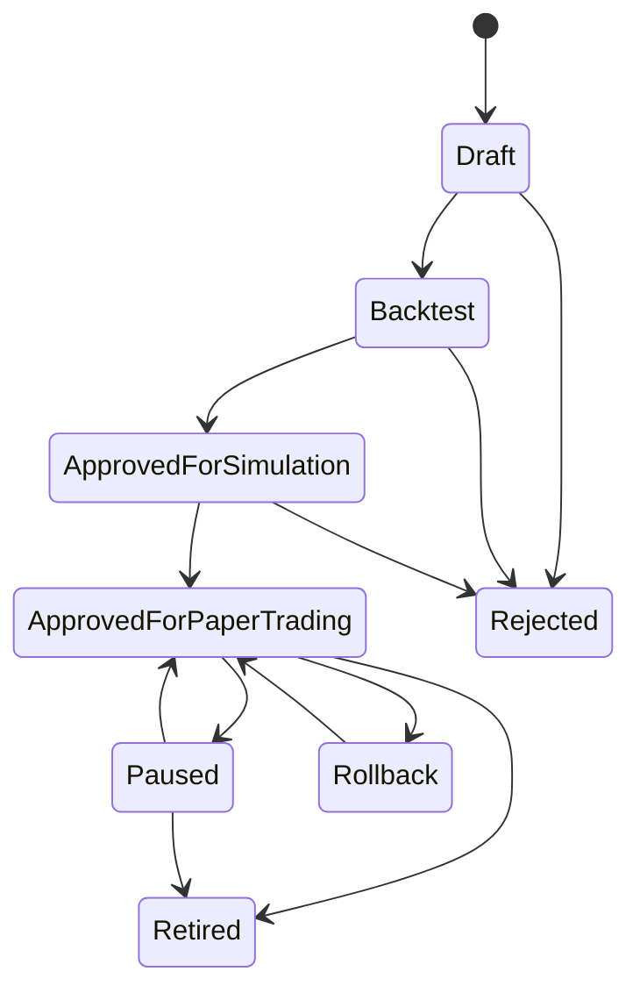
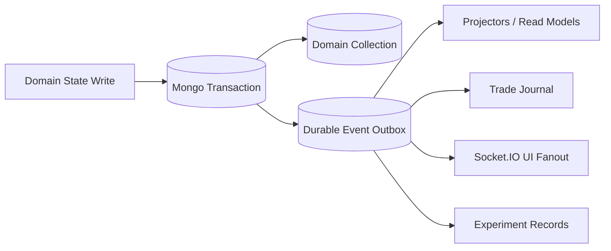
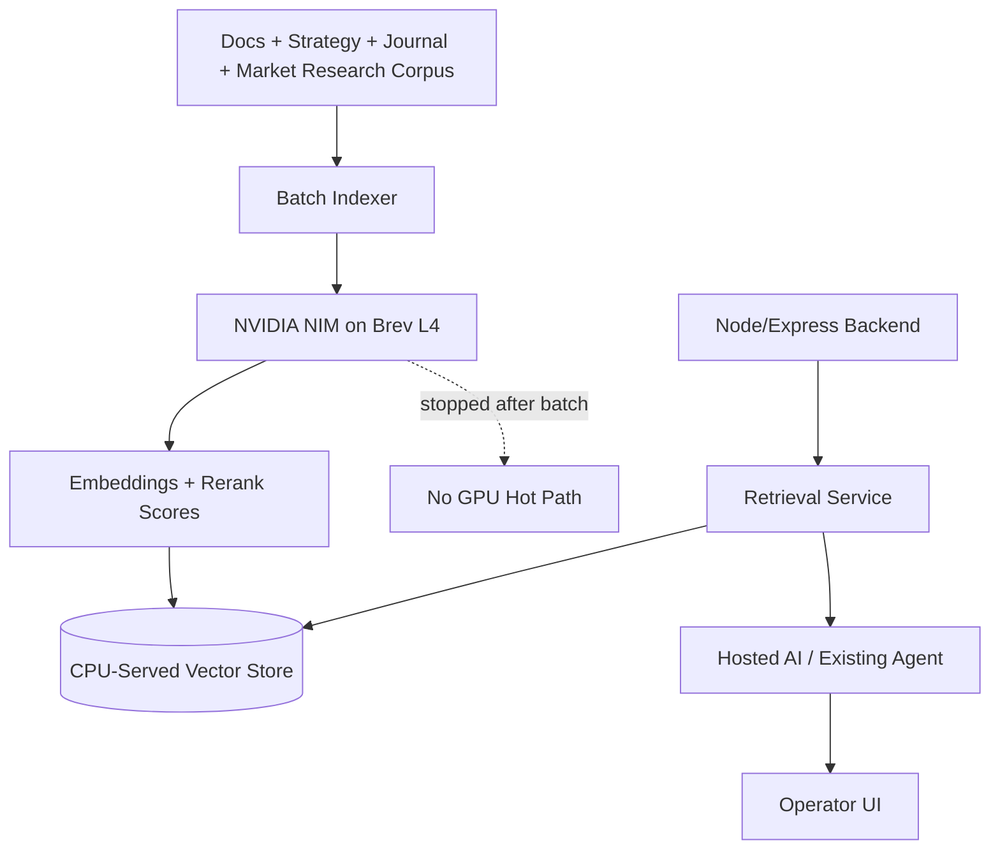

# AI-Trader v2 Master Architecture

Date: 2026-07-25
Status: authoritative for AI-Trader v2 planning
Preserved source reports:

- `docs/audits/ENTERPRISE_STRATEGY_ENGINE_READINESS_AUDIT.md`
- `docs/architecture/NVIDIA_BREV_ENTERPRISE_INTEGRATION_STRATEGY.md`

Baseline preserved:

- Release: `v1.1-enterprise-baseline`
- Commit: `b31f6c83d1136d9c5093034ae0be50e6b8b2caf3`
- Production baseline: paper-trading only

This document is planning authority only. It does not authorize production behavior changes, live-money execution, or Strategy Engine implementation before the required foundations are complete.

## 1. Executive Decision

AI-Trader v2 may begin now with foundation work only:

- Strategy contracts.
- Event contracts.
- Feature-store design.
- Backtesting hardening.
- Experiment tracking.
- RAG prototype.
- Paper-trading research.
- Documentation governance.
- Authentication and RBAC design/implementation.
- Durable event/outbox foundation.

AI-Trader v2 remains prohibited from:

- Autonomous live trading.
- Production reinforcement learning.
- Unreviewed strategy self-modification.
- Direct AI order authority.
- GPU-required production execution.
- Multi-account automation without identity isolation.
- Multi-position autonomous trading until specifically designed, tested, and certified.

Decision: AI-Trader is production-stable for the certified paper-trading baseline, but the Strategy Engine must be built as a controlled, paper-only, deterministic, replayable, versioned architecture before any live-money discussion.

Traceability: BOTH.

## 2. Architecture Principles

| Principle | Source |
| --- | --- |
| Paper trading first. | AUDIT |
| Deterministic logic before adaptive logic. | BOTH |
| AI proposes; deterministic systems decide. | BOTH |
| Every strategy and decision is versioned. | AUDIT |
| Every decision is replayable. | AUDIT |
| Every order is idempotent. | REPOSITORY_VERIFICATION |
| Every state change is attributable to an actor. | AUDIT |
| Socket.IO is UI fanout, not the system of record. | AUDIT |
| Mongo-backed durable events precede a larger event-bus migration. | AUDIT |
| GPU use must be measurable, stoppable, and optional. | NVIDIA |
| Massive Advanced Options data is the initial feature boundary. | BOTH |
| Production must continue operating when Brev/NVIDIA GPU services are unavailable. | NVIDIA |
| Strategy promotion requires deterministic evidence and human approval. | BOTH |
| Reinforcement learning remains offline research with no production execution path. | BOTH |

## 3. Target Domains

| Domain | Ownership | Boundary |
| --- | --- | --- |
| Market Data | Own Massive REST/WS access, provider health, cache, entitlement state | No browser Massive credentials; no unauthorized equity real-time assumptions |
| Feature Store | Persist versioned, point-in-time features | Does not choose trades |
| Strategy Engine | Evaluate versioned strategy contracts over feature windows | Paper-only in v2 foundation |
| Signal Engine | Produce versioned directional/non-directional signals | Cannot approve orders |
| Risk Engine | Approve/reject candidates against account, strategy, data, and portfolio rules | Cannot submit orders |
| Execution Engine | Convert approved intents into broker operations | Paper only until live certification |
| Broker Adapters | Isolate Alpaca paper and future broker implementations | Live adapters prohibited in v2 foundation |
| Portfolio Engine | Aggregate positions, P&L, exposure, attribution | Must be account-scoped |
| Position Manager | Manage position lifecycle and exits | Must consume broker truth |
| Order Manager | Own order state machine, idempotency, reconciliation | Must emit durable order events |
| Trade Journal | Persist trade and decision narratives with evidence links | Must be derived from durable state |
| Backtesting | Replay strategies against versioned datasets | Must prevent look-ahead bias |
| Experiment Tracking | Record runs, metrics, artifacts, datasets, strategy versions | Required before strategy promotion |
| Learning Dataset | Curate labels, outcomes, and feedback for future ML/RL | No production RL execution |
| AI and Retrieval | Advisory context, RAG, summarization, strategy drafting | No direct execution authority |
| Operations | Health, runbooks, kill switches, deployment evidence | Must not overstate health |
| Authentication and Authorization | Identity, RBAC, account isolation, actor attribution | Required for v2 state changes |
| Observability | Logs, metrics, traces, audits, alerts | Must support incident review and replay |

## 4. Data Entitlement Boundary

Initial v2 design uses only current Massive Advanced Options Market Data and already integrated APIs.

Provider fields currently used or verified:

| Field / Source | Entitlement Status | Use |
| --- | --- | --- |
| Options chains | Available under options entitlement | Matrix, scanner, selection, strategy features |
| Options contracts/reference | Available | Expiration, strike, type, metadata |
| Options quotes | Available | Top of book, spreads, marks, quote freshness |
| Options trades | Available | Time and sales, flow windows |
| Options snapshots | Available | Chain hydration, greeks, IV, OI, underlying context fallback |
| Greeks | Available through options snapshots where provider supplies | Risk, selection, reports |
| Implied volatility | Available through options snapshots where provider supplies | Volatility features and reports |
| Open interest | Available | Liquidity and risk filters |
| Volume/day stats | Available | Liquidity and signal features |
| Spreads | Calculated from bid/ask | Risk and selection gates |
| Authorized aggregates | Available where entitlement permits | Charts, feature windows, backtesting where authorized |
| Market status | Available | Session gates |
| News/sentiment/context | Available where provider supplies | Advisory AI/RAG context |

Premium real-time equity feeds are not assumed. Current-day stock intraday aggregates are not a production dependency. Stocks WebSocket is not part of the certified options-advanced baseline.

Every feature must include:

- Provider source.
- Entitlement status.
- Provider timestamp.
- Ingest timestamp.
- Freshness.
- Calculation version.
- Missing-data behavior.
- Quality status.
- Point-in-time dataset ID when used in backtests.

Traceability: BOTH, REPOSITORY_VERIFICATION.

## 5. Feature Store Specification

The Feature Store is the foundation for Strategy Engine, backtesting, experiment tracking, and future learning.

Feature definition requirements:

- `featureId`: stable identifier.
- `featureVersion`: semantic or monotonic version.
- `name`: human-readable name.
- `description`: what the feature means.
- `assetClass`: options, equity-context, portfolio, broker, journal, macro, news.
- `providerSource`: Massive, Alpaca, Mongo-derived, AI-derived advisory, manual.
- `entitlementStatus`: authorized, delayed, snapshot-only, unavailable, derived.
- `calculationVersion`: code version used to calculate.
- `requiredInputs`: upstream fields/events.
- `timestampPolicy`: provider time, market window, calculation time.
- `freshnessPolicy`: max age and stale behavior.
- `missingDataPolicy`: reject, degrade, impute, omit, advisory-only.
- `qualityStatus`: green, yellow, red, unknown.
- `retentionPolicy`: online/offline retention.

Historical feature windows:

- Store closed windows only for backtesting.
- Persist window start/end, market session, timezone, and source event IDs.
- Prevent look-ahead bias by excluding events ingested after the decision timestamp.
- Preserve raw or normalized input references.

Online versus offline:

- Online features may feed paper-trading decisions only when freshness and quality gates pass.
- Offline features may support research, backtesting, RAG, and learning datasets.
- Offline-only or AI-derived features must not silently enter live decision gates.

Reproducibility:

- Every backtest references dataset ID, feature versions, strategy version, code commit, and configuration snapshot.
- Every dataset version is immutable after publication.
- Corrections produce new dataset versions.

Traceability: AUDIT, BOTH.

## 6. Strategy Engine Specification

Strategy contract fields:

- `strategyId`
- `strategyVersion`
- `name`
- `description`
- `ownerActorId`
- `lifecycleStatus`
- `assetClass`
- `requiredFeatures`
- `signalRules`
- `riskRequirements`
- `entryRules`
- `exitRules`
- `sizingPolicy`
- `timeWindowPolicy`
- `dataQualityPolicy`
- `explainabilityTemplate`
- `performanceAttributionPolicy`
- `promotionGates`
- `killSwitches`
- `rollbackTarget`

Lifecycle:

Promotion requirements:

- Deterministic strategy version.
- Declared features.
- Reproducible backtest.
- Walk-forward validation.
- Out-of-sample validation.
- Baseline comparison.
- Risk review.
- Human approval.
- Paper-only approval before any production execution discussion.

Kill switches:

- Per-strategy pause.
- Global automation emergency stop.
- Broker submission kill switch.
- Data-quality kill switch.
- Risk-budget kill switch.

Traceability: AUDIT, BOTH.

## 7. Durable Event Architecture

Start with a Mongo-backed transactional outbox or equivalent durable event log. Do not introduce Kafka/NATS/etc. before the event contract is proven.

Minimum events:

| Event | Purpose |
| --- | --- |
| `MarketSnapshotIngested` | Raw/normalized provider data persisted |
| `FeatureCalculated` | Versioned feature emitted |
| `StrategyEvaluationStarted` | Strategy evaluation began |
| `SignalGenerated` | Signal emitted by strategy/signal engine |
| `RiskDecisionMade` | Risk approval/rejection |
| `OrderIntentCreated` | Durable intent created |
| `OrderIntentApproved` | Intent passed approval gates |
| `OrderSubmitted` | Broker submission attempted |
| `FillObserved` | Broker fill observed |
| `PositionOpened` | Position lifecycle opened |
| `ExitTriggered` | Exit condition triggered |
| `PositionClosed` | Position lifecycle closed |
| `JournalEntryCreated` | Journal record created |
| `BacktestStarted` | Backtest run began |
| `BacktestCompleted` | Backtest completed |
| `ExperimentCompleted` | Experiment completed |
| `DatasetVersionCreated` | Dataset version published |
| `StrategyPromoted` | Strategy lifecycle promotion |
| `StrategyPaused` | Strategy paused |
| `EmergencyStopActivated` | Emergency control activated |

Every event requires:

- `eventId`
- `eventVersion`
- `eventType`
- `aggregateId`
- `aggregateType`
- `correlationId`
- `causationId`
- `actorId`
- `strategyId`
- `strategyVersion`
- `accountId`
- `timestamp`
- `payloadSchemaVersion`
- `payload`
- `idempotencyKey`
- `retentionPolicy`
- `replayBehavior`

Idempotency behavior:

- Event ID is globally unique.
- Idempotency key prevents duplicate domain effects.
- Projectors must be idempotent.
- Replays must not call brokers or external side-effect services.

Traceability: AUDIT.

## 8. Security Foundation

Required work:

- Global authentication middleware.
- Session identity.
- RBAC.
- Viewer role.
- Trader role.
- Operator role.
- Administrator role.
- Route-level authorization.
- Account isolation.
- Audit attribution.
- Replay prevention.
- CSRF policy where applicable.
- Idempotency policy.
- Secret scanning in CI.
- Credential rotation procedure.
- Emergency controls.
- Live-trading prohibition.

Role outline:

| Role | Allowed |
| --- | --- |
| Viewer | Read-only dashboards and reports |
| Trader | Paper manual intents and watchlist edits within account |
| Operator | Automation pause/resume/emergency controls for paper |
| Administrator | Configuration, admin-gated reports, user/role management |

Protected route classes:

- Watchlist writes.
- Broker reads and writes.
- Manual trading.
- Automation controls.
- Portfolio close/cancel controls.
- Strategy/lab mutation.
- Engine trigger/status changes.
- Handoff approval.
- Intelligence generation/backfills.
- Future event replay/admin tools.

Traceability: AUDIT, REPOSITORY_VERIFICATION.

## 9. Backtesting and Experiment Tracking

Backtesting requirements:

- Reproducible datasets.
- Dataset versions.
- Strategy versions.
- Feature versions.
- Configuration snapshots.
- Commission models.
- Slippage models.
- Liquidity assumptions.
- Walk-forward validation.
- Out-of-sample testing.
- Naive baseline comparisons.
- Metrics.
- Artifacts.
- Run IDs.
- Random seeds.
- Promotion requirements.
- Rejection requirements.

Experiment tracking record:

- `experimentId`
- `runId`
- `strategyId`
- `strategyVersion`
- `datasetId`
- `datasetVersion`
- `featureVersions`
- `codeCommit`
- `configurationSnapshot`
- `randomSeed`
- `startedAt`
- `completedAt`
- `metrics`
- `artifacts`
- `baselineComparison`
- `reviewStatus`
- `reviewerActorId`
- `promotionDecision`

Promotion is rejected when:

- Dataset is not reproducible.
- Feature versions are missing.
- Walk-forward validation fails.
- Naive baseline is not beaten.
- Risk limits are violated.
- Metrics are not statistically meaningful.
- Human approval is absent.

Traceability: AUDIT, BOTH.

## 10. Learning Foundation

Do not design production RL execution in v2.

Design the data foundation:

- Trade history.
- Decision history.
- Feature history.
- Signal history.
- Risk-decision history.
- Order history.
- Fill history.
- Outcome labels.
- Reward-candidate datasets.
- Experiment history.
- Strategy-performance history.
- Human-review feedback.

AI or ML may propose changes, but may not automatically promote, deploy, or execute them.

Learning datasets must be:

- Immutable by version.
- Paper/live segregated.
- Free of secrets.
- Point-in-time correct.
- Traceable to source events.
- Approved for research use.

Traceability: BOTH.

## 11. NVIDIA Integration

NVIDIA integration is additive retrieval infrastructure:

- Documentation corpus.
- Architecture corpus.
- Massive research corpus.
- Strategy corpus.
- Trade-journal corpus.
- Decision-journal corpus.
- Embedding pipeline.
- Reranking pipeline.
- Vector storage.
- Retrieval service.
- Provenance and citations.
- Index versioning.
- Nightly or scheduled incremental indexing.
- CPU serving after GPU indexing.
- GPU shutdown after jobs complete.

Initial proof of value:

1. Prototype embeddings using available hosted NVIDIA developer credits where appropriate.
2. Use a short Brev L4 session for embedding and reranking validation.
3. Persist vectors into a CPU-served vector store.
4. Keep production request path operational even when Brev is unavailable.
5. Measure retrieval quality, latency, cost, and usefulness before expansion.

Recommended architecture:

NVIDIA requirements:

- GPU is optional.
- GPU is stoppable.
- GPU is not required for production trading.
- Hosted AI remains until measurements justify migration.
- L4 is preferred for NIM embeddings/reranking.
- A6000 is optional for embedding fine-tune/benchmarks.
- L40S is optional for short self-hosted LLM learning.
- T4 is not used for NIM.
- RL remains offline research.

Traceability: NVIDIA, BOTH.

## 12. Implementation Roadmap

### Phase 0: Documentation and Architecture Lock

Dependencies:

- Current certified v1.1 baseline.
- Preserved source reports.

Work:

- Create canonical v2 master architecture.
- Create implementation backlog.
- Create ADRs.
- Update docs index/governance.

Acceptance criteria:

- Both source reports preserved.
- Traceability matrix includes all source recommendations.
- Omitted recommendation count is zero.

Rollback:

- Revert documentation-only changes.

Production impact:

- None.

### Phase 1: Auth, RBAC, Contracts, and Event Foundation

Dependencies:

- Phase 0 complete.

Work:

- Global authentication.
- RBAC.
- Account isolation model.
- Strategy contract schema.
- Durable outbox/event schema.
- Actor attribution.

Expected tests:

- Auth middleware tests.
- Route authorization tests.
- Event idempotency tests.
- Outbox replay safety tests.

Rollback:

- Feature flags for auth enforcement during rollout.
- No live execution paths introduced.

Production impact:

- Should be staged carefully because auth changes affect access.

### Phase 2: Feature Store and Reproducible Backtesting

Dependencies:

- Event schema.
- Strategy contract.
- Market-data provenance rules.

Work:

- Feature definitions.
- Feature windows.
- Dataset versions.
- Backtest reproducibility.
- Slippage/commission/liquidity models.

Expected tests:

- Point-in-time correctness.
- Look-ahead bias prevention.
- Dataset immutability.
- Backtest replay determinism.

Rollback:

- Keep existing paper baseline unchanged.

### Phase 3: Experiment Tracking and Paper-Only Strategy Engine

Dependencies:

- Feature Store.
- Backtesting.
- Durable event log.
- RBAC.

Work:

- Experiment records.
- Paper-only Strategy Engine integration.
- Promotion/rejection workflow.
- Human approval.

Expected tests:

- Promotion gate tests.
- Paper-only execution gate tests.
- Strategy rollback tests.

Production impact:

- Paper-only, behind explicit gates.

### Phase 4: RAG and Semantic Retrieval

Dependencies:

- Corpus allowlist.
- Secret-scan policy.
- Retrieval service design.

Work:

- Embedding pipeline.
- Reranking validation.
- CPU vector store.
- AI citations/provenance.
- GPU cost controls.

Expected tests:

- Corpus redaction.
- Index versioning.
- Retrieval fallback when Brev unavailable.
- Latency and quality measurement.

Production impact:

- Advisory only.

### Phase 5: Multi-Strategy Simulation

Dependencies:

- Strategy Engine paper integration.
- Experiment tracking.
- Portfolio/risk event model.

Work:

- Multi-strategy simulation.
- Conflict resolution.
- Portfolio attribution.
- Risk aggregation.

Production impact:

- Simulation only.

### Phase 6: Learning Datasets and Offline Research

Dependencies:

- Event history.
- Feature history.
- Experiment history.

Work:

- Outcome labels.
- Reward-candidate datasets.
- Offline ML/RL experiments.
- Human review feedback loop.

Production impact:

- No production RL execution.

## 13. Traceability Matrix

| Requirement ID | Recommendation | Source | Section | Phase | Status | Verification |
| --- | --- | --- | --- | --- | --- | --- |
| V2-001 | Preserve v1.1 certified paper baseline | REPOSITORY_VERIFICATION | 1 | 0 | Planned | Git refs and docs |
| V2-002 | Strategy Engine remains paper-only during v2 foundation | AUDIT | 1, 6 | 1-3 | Planned | ADR + route gates |
| V2-003 | Prohibit autonomous live trading | BOTH | 1, 8 | 1 | Planned | Auth/RBAC + config tests |
| V2-004 | AI has no direct order authority | BOTH | 2, 10 | 1 | Planned | ADR + execution tests |
| V2-005 | Direct AI strategy self-modification prohibited | BOTH | 1, 10 | 3 | Planned | Promotion workflow tests |
| V2-006 | Deterministic logic before adaptive logic | BOTH | 2 | 1-6 | Planned | ADR + review gates |
| V2-007 | Every strategy is versioned | AUDIT | 6 | 1 | Planned | Schema tests |
| V2-008 | Every decision is replayable | AUDIT | 7 | 1-3 | Planned | Event replay tests |
| V2-009 | Every order is idempotent | REPOSITORY_VERIFICATION | 2, 7 | 1 | Existing/extend | Existing + new idempotency tests |
| V2-010 | Every state change has actor attribution | AUDIT | 8 | 1 | Planned | Auth + event tests |
| V2-011 | Socket.IO remains UI fanout only | AUDIT | 7 | 1 | Planned | ADR + architecture review |
| V2-012 | Mongo durable outbox before larger event platform | AUDIT | 7 | 1 | Planned | ADR + outbox tests |
| V2-013 | Massive Advanced Options data is feature boundary | BOTH | 4 | 1-2 | Planned | Feature schema tests |
| V2-014 | Do not assume premium equity real-time data | BOTH | 4 | 1-2 | Planned | Entitlement tests |
| V2-015 | Feature records include provider source | AUDIT | 4, 5 | 2 | Planned | Feature schema tests |
| V2-016 | Feature records include entitlement status | AUDIT | 4, 5 | 2 | Planned | Feature schema tests |
| V2-017 | Feature records include timestamp/freshness | AUDIT | 4, 5 | 2 | Planned | Staleness tests |
| V2-018 | Feature records include calculation version | AUDIT | 4, 5 | 2 | Planned | Version tests |
| V2-019 | Missing data behavior is explicit | AUDIT | 4, 5 | 2 | Planned | Data-quality tests |
| V2-020 | Quality status is explicit | AUDIT | 4, 5 | 2 | Planned | Data-quality tests |
| V2-021 | Global authentication required | AUDIT | 8 | 1 | Planned | Middleware tests |
| V2-022 | RBAC required | AUDIT | 8 | 1 | Planned | Authorization tests |
| V2-023 | Account isolation required | AUDIT | 8 | 1 | Planned | Multi-account tests |
| V2-024 | Secret scanning and rotation required | AUDIT | 8 | 1 | Planned | CI scan + runbook |
| V2-025 | Emergency controls remain mandatory | AUDIT | 8 | 1-3 | Existing/extend | Existing + new role tests |
| V2-026 | Backtests must be reproducible | AUDIT | 9 | 2 | Planned | Replay tests |
| V2-027 | Dataset versions required | AUDIT | 5, 9 | 2 | Planned | Dataset immutability tests |
| V2-028 | Strategy versions required for experiments | AUDIT | 6, 9 | 3 | Planned | Experiment schema tests |
| V2-029 | Feature versions required for experiments | AUDIT | 5, 9 | 3 | Planned | Experiment schema tests |
| V2-030 | Walk-forward validation required | BOTH | 9 | 2-3 | Planned | Backtest acceptance tests |
| V2-031 | Out-of-sample validation required | AUDIT | 9 | 2-3 | Planned | Backtest acceptance tests |
| V2-032 | Naive baselines required | BOTH | 9 | 2-3 | Planned | Experiment tests |
| V2-033 | Experiment tracking required | AUDIT | 9 | 3 | Planned | Experiment CRUD/tests |
| V2-034 | Learning foundation is data-first, not execution-first | BOTH | 10 | 6 | Planned | Dataset review |
| V2-035 | RL remains offline research | BOTH | 10, 11 | 6 | Planned | ADR + route absence |
| V2-036 | GPU infrastructure must not be production hot path | NVIDIA | 11 | 4 | Planned | Fallback tests |
| V2-037 | Highest-value NVIDIA use is embeddings/reranking/RAG | NVIDIA | 11 | 4 | Planned | RAG prototype metrics |
| V2-038 | Hosted AI remains until measurements justify migration | NVIDIA | 11 | 4 | Planned | Cost/latency report |
| V2-039 | Use hosted NVIDIA developer credits before Brev spend where available | NVIDIA | 11 | 4 | Planned | Experiment record |
| V2-040 | Use short Brev L4 for embedding/reranking validation | NVIDIA | 11 | 4 | Planned | Experiment record |
| V2-041 | Persist vectors into CPU-served vector store | NVIDIA | 11 | 4 | Planned | Retrieval fallback tests |
| V2-042 | GPU shuts down after indexing/jobs | NVIDIA | 11 | 4 | Planned | Cost-control checklist |
| V2-043 | T4 is not NIM-compatible and must not be chosen for NIM | NVIDIA | 11 | 4 | Planned | Runbook check |
| V2-044 | A6000 may be used for optional embedding fine-tune/benchmark | NVIDIA | 11 | 4 | Planned | Experiment approval |
| V2-045 | L40S may be used for short LLM NIM learning only | NVIDIA | 11 | 4 | Planned | Experiment approval |
| V2-046 | Do not migrate production AI to self-hosted LLM on current budget | NVIDIA | 11 | 4 | Planned | Architecture review |
| V2-047 | Do not hand-write CUDA now | NVIDIA | 11 | 6 | Planned | ADR/governance |
| V2-048 | Do not adopt direct TensorRT/TensorRT-LLM now | NVIDIA | 11 | 6 | Planned | ADR/governance |
| V2-049 | GPU vector search waits for scale proof | NVIDIA | 11 | 6 | Planned | Benchmark threshold |
| V2-050 | Time-series foundation models are research-only, not directional authority | NVIDIA | 10, 11 | 6 | Planned | Experiment policy |
| V2-051 | Stabilize client Vitest teardown flake | AUDIT | 9 | 1 | Planned | Repeat test runs |
| V2-052 | Correct documentation drift | AUDIT | 12 | 0-1 | Planned | Docs review |
| V2-053 | Remove or quarantine raw/prototype docs from canonical path | AUDIT | 12 | 1 | Planned | Docs governance |
| V2-054 | Add load/soak suites for Socket.IO, Massive, automation, AI, broker | AUDIT | 9 | 2-3 | Planned | Load test reports |
| V2-055 | Multi-position autonomous support requires explicit future design | AUDIT | 1, 6 | 5 | Planned | ADR/design review |

## Requirement-Preservation Count

This master document preserves:

- Enterprise audit recommendations extracted: 35.
- NVIDIA report recommendations extracted: 20.
- Merged canonical requirements: 55.
- Source recommendations retained as independent requirements where not merged: 0.
- Source recommendations omitted: 0.

The merged requirements intentionally keep overlapping safety recommendations as shared `BOTH` entries rather than dropping either source.
