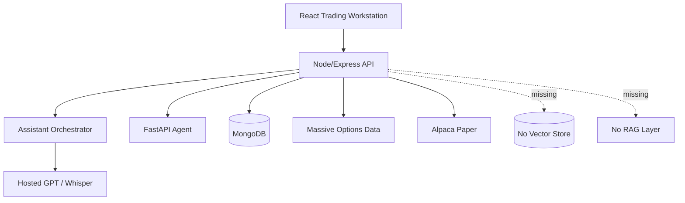
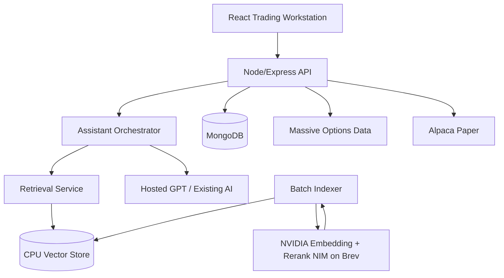

# NVIDIA Brev Enterprise Integration Strategy

Date: 2026-07-25
Account context: authenticated owner account, organization `mark.velasquez-9bb070-bjor`
Organization ID: masked as `org-3FaX...01Az`
Credit balance supplied by owner: approximately `$25`
Scope: NVIDIA/Brev architecture strategy only. No product features were implemented.

## Executive Summary

For AI-Trader at its current scale, NVIDIA Brev is not a cost-saver for the hosted LLM and transcription work already in production. GPT-4o and transcription are fully outsourced, and a self-hosted small LLM on a GPU would bill wall-clock time whether requests arrive or not. Chasing cheaper inference with only about `$25` in credits is a false economy.

The strongest NVIDIA use case is a capability the platform does not currently have: embeddings, reranking, semantic retrieval, and RAG. The repository currently has no embedding pipeline, no vector search, and no RAG layer. Standing up an NVIDIA embedding and reranking NIM on a short Brev L4 session to index market news, filings, architecture docs, strategy history, decision journals, and trade journals is the one clear high-value use of the credits.

Everything else is learn-or-later:

- Local LLMs are not justified until hosted-token volume and latency/cost measurements justify migration.
- TensorRT/TensorRT-LLM hand tuning is not needed because NIM packages optimized serving.
- Time-series foundation models and reinforcement learning are research-only and high false-alpha risk.
- GPU vector search is premature for the expected corpus size.
- Model training is not justified until labeled datasets exist, except for a short embedding fine-tune experiment after RAG value is proven.

Brev's strategic value is optionality: a per-hour, stoppable, multi-cloud GPU control plane for research, indexing, training, and benchmarking jobs. It must not become a required production dependency.

One key correction affects GPU choice: the T4 16 GB is the cheapest observed GPU, but it cannot run NVIDIA NIM because its CUDA compute capability is 7.5. NIM optimized engines require compute capability at least 8.0, and FP8 paths require 8.9 or higher. The practical floor for NIM work is an L4 24 GB.

## Account and CLI State

Observed from authenticated Brev CLI v0.6.331:

- CLI installed and authenticated.
- Active organization: `mark.velasquez-9bb070-bjor`.
- Organization ID was verified but is intentionally masked in this document.
- Instances running: `0`.
- Current burn rate from active instances: `$0/hr`.
- CLI healthcheck: healthy.
- CLI supports instance search, creation, shell, exec, open, copy, port-forward, organization management, and device registration.
- CLI includes `redeem`, but no balance-read command was observed. The owner-supplied approximate credit balance is `$25`; track exact remaining balance in the Brev web console.

No authentication cookies, login URLs, refresh tokens, API keys, or credentials are preserved in this document.

## Brev Platform Primitives

Relevant Brev primitives:

- GPU instances: preconfigured VMs with CUDA/Docker/Jupyter-style ML workflows.
- CPU instances: low-cost compute boxes, useful mostly as disposable harnesses.
- Environments: preinstalled software stacks.
- Launchables: shareable hardware/software/code bundles that can launch VMs, containers, compose stacks, or Kubernetes-style workloads.
- NIM deployment: first-class deploy path for OpenAI-compatible NIM endpoints, commonly exposed on port `8000`.
- Access: `brev shell`, `brev exec`, `brev open`, `brev copy`, and `brev port-forward`.
- Editor support: remote VS Code, Cursor, Windsurf, terminal, and tmux.
- Public access: tunnel or launchable secure endpoint, if explicitly enabled.
- Management: CLI-first. No official Python management SDK was identified during the review.

## GPU and CPU Capability Inventory

Pricing observations are from live `brev search` output during the audit and can change by region, provider, capacity, and time. Treat these numbers as observed-at-audit-time estimates, not procurement commitments.

| GPU | VRAM | Architecture / Compute Capability | Observed from $/hr | Approx $25 runtime | NIM suitability | Best use |
| --- | ---: | --- | ---: | ---: | --- | --- |
| T4 | 16 GB | Turing / 7.5 | `$0.48/hr` | ~52 hrs | No | Generic CUDA/PyTorch only; not NIM |
| A6000 | 48 GB | Ampere / 8.6 | `$0.60-$0.68/hr` | ~36-41 hrs | BF16 paths | Best value 48 GB; embedding fine-tune or benchmarks |
| L4 | 24 GB | Ada / 8.9 | `$0.85/hr` | ~29 hrs | FP8-capable | Top pick for embedding and reranking NIM |
| L40S | 48 GB | Ada / 8.9 | `$1.06/hr` | ~23 hrs | FP8-capable | LLM NIM learning with headroom |
| A10G | 22 GB | Ampere / 8.6 | `$1.21/hr` | ~20 hrs | BF16 paths | 8B LLM NIM experiments |
| A100 | 40/80 GB | Ampere / 8.0 | `$1.63-$1.66/hr` | ~15 hrs | BF16 paths | Short fine-tune bursts, larger batch inference |
| H100 | 80 GB | Hopper / 9.0 | higher, observed around `$3/hr` class in report context | ~8 hrs at `$3/hr` | FP8-capable | Overkill for current platform |

CPU inventory:

- CPU-only instances start around `$0.05/hr`.
- Examples observed include GCP `n2d-highcpu-2` at roughly `$0.05/hr` and higher-memory CPU boxes from roughly `$0.09-$0.72/hr`.
- Recommendation: do not move production Node/Express/Mongo, Socket.IO fanout, or ordinary pandas backtests to Brev CPU. Those workloads belong on existing production infrastructure unless paired with a GPU experiment.

Storage cost note:

- Persistent disks add cost even when compute is stopped.
- The report estimated about `$0.0001314/GB/hr`, roughly `$0.32/day` for 100 GB. Delete or snapshot intentionally instead of leaving large idle disks.

## GPU Compute-Capability and NIM Compatibility

NIM compatibility matters more than raw hourly cost:

- T4 has compute capability 7.5 and is not suitable for NVIDIA NIM optimized engines.
- Ampere-class GPUs such as A6000, A10G, and A100 support BF16-oriented NIM paths.
- Ada-class GPUs such as L4 and L40S support FP8-oriented paths and are better NIM targets.
- The correct practical floor for NIM embedding/reranking work is L4 24 GB.
- Use T4 only for generic CUDA or PyTorch experiments that do not require NIM.

## Capability Matrix

| Capability | Verdict | Rationale tied to AI-Trader |
| --- | --- | --- |
| Embedding models | Do now | Tiny relative to LLMs, batchable, one-time or nightly indexing, unlocks semantic recall. |
| RAG pipeline | Do now | Repository has no embeddings/vector/RAG today; this is a genuine new advisory capability. |
| Reranking NIM | Do now | Pairs with embeddings to improve retrieval quality; L4 is suitable. |
| NIM microservices | Do now for embeddings/reranking | OpenAI-compatible endpoint means integration can be a base URL/client seam. |
| Agent orchestration | Later | Existing orchestrator uses hosted GPT; keep it. Revisit NeMo Agent Toolkit only when self-hosting. |
| Local/self-hosted LLM | Later | Hosted APIs win on cost/latency until measured high utilization. Spend only a small learning session. |
| CUDA direct | Later | Avoid hand-written CUDA. Use NIM/RAPIDS/cuDF/cuVS when justified. |
| TensorRT/TensorRT-LLM | Not now | NIM hides most optimization. Direct engine builds are not worth the operational cost now. |
| Time-series foundation models | Not now | High false-alpha risk; if explored, target volatility/volume research, not directional live trading. |
| GPU vector search | Not now | CPU pgvector/FAISS is simpler until corpus reaches very large scale or high batched QPS. |
| Model training | Not now | No labeled dataset assembled. Exception: small embedding-domain fine-tune after RAG value is proven. |
| Reinforcement learning | Not now | Must remain offline, paper-only research. GPU cost is not the risk; false alpha is. |

## Embedding Recommendation

Use NVIDIA for embeddings first.

Recommended corpus:

- Architecture docs.
- Production certification docs.
- Massive integration docs.
- Strategy definitions.
- Watchlist and automation docs.
- Market news and filings where available.
- Trade journal.
- Decision journal.
- Strategy analytics and daily reports.

Recommended workflow:

1. Prototype with hosted NVIDIA developer credits where available.
2. Batch embed the corpus on a short Brev L4 session.
3. Persist vectors into a CPU-served vector store.
4. Turn off or delete the GPU instance.
5. Query the vector store from the existing Node/agent orchestration path.

## Reranking Recommendation

Use reranking after initial embedding retrieval:

- Retrieve top `k` candidates from CPU vector store.
- Rerank with an NVIDIA reranking NIM during offline validation or batch jobs.
- Compare answer quality and citation usefulness against embeddings-only retrieval.
- Keep reranking optional until latency and cost are measured.

## RAG Recommendation

Build RAG as an additive advisory layer, not as a replacement for deterministic trading logic.

RAG should:

- Retrieve source-grounded context for the AI desk.
- Support citations/provenance.
- Improve strategy-review and post-trade analysis.
- Help operators ask questions across architecture, journal, news, and strategy history.

RAG must not:

- Submit orders.
- Modify strategies.
- Promote strategies.
- Override risk decisions.
- Become required for production execution.

## Local LLM Recommendation

Keep hosted AI services in place until measurements justify migration.

Only run a short L40S/A10G learning session to:

- Deploy an 8B LLM NIM.
- Validate the OpenAI-compatible base URL swap.
- Measure tokens/sec.
- Compare cost per million tokens against current hosted usage.
- Document cold start, latency, ops burden, and quality.

Do not migrate production AI to self-hosted LLMs on the current credit budget.

## CUDA Recommendation

Do not hand-write CUDA. Use packaged acceleration through:

- NIM for inference.
- RAPIDS/cuDF for future feature-prep acceleration.
- cuVS only when vector scale requires it.

Direct CUDA work is not aligned with the current platform risks.

## TensorRT Recommendation

Do not adopt direct TensorRT or TensorRT-LLM workflows now.

Reasons:

- NIM already packages optimized engines.
- Engine builds are operationally expensive.
- Model serving is not the current bottleneck.
- The team needs strategy, event, feature, and security contracts before low-level inference tuning.

## Time-Series-Model Recommendation

Do not prioritize time-series foundation models for directional options trading.

If explored later:

- Use them for volatility, volume, liquidity, or regime research rather than directional prediction.
- Require naive baselines.
- Require walk-forward validation.
- Keep results paper-only.
- Treat as experiment-tracking data, not production signal authority.

## Vector-Search Recommendation

Use CPU-served vector search first:

- pgvector if the team wants Postgres semantics.
- FAISS CPU if the team wants file-backed/local retrieval.
- Mongo vector search only if it fits the existing Atlas posture and cost.

GPU vector search should wait until:

- Corpus grows toward very large scale.
- Query volume becomes high.
- CPU retrieval latency is proven to be a bottleneck.
- A benchmark shows cuVS/CAGRA wins for the actual workload.

## Model-Training Recommendation

Do not start model training initiatives until labeled datasets exist.

Allowed small experiment:

- Fine-tune an embedding model on AI-Trader domain text after baseline RAG quality is measured.
- Run as a short A6000 burst.
- Record dataset version, parameters, metrics, and retrieval-quality changes.

## Reinforcement-Learning Recommendation

RL remains offline, paper-only research.

Do not use RL for production execution because:

- Reward hacking is likely.
- Backtest overfitting can appear as alpha.
- Trading environments are non-stationary.
- Explainability and control are weaker than deterministic strategies.
- The platform lacks reproducible datasets and experiment tracking today.

If explored later, use FinRL-style or custom environments only for learning. Require walk-forward validation, naive baselines, and human review. Never promote RL output directly to live or paper execution without deterministic conversion and approval.

## Current Architecture



Current AI surface is hosted-API based. There is no repository evidence of embeddings, vector indexing, semantic retrieval, or RAG.

## Recommended Architecture



The GPU is in the indexing/validation path. The production hot path continues to work when Brev is unavailable.

## Integration Seam

The integration seam is an OpenAI-compatible embeddings endpoint:

```text
Indexer -> /v1/embeddings on NIM endpoint
Indexer -> vector store write
Orchestrator -> retrieval service -> CPU vector store
Orchestrator -> hosted AI with cited context
```

Requirements:

- No browser access to NVIDIA credentials.
- No GPU dependency in execution path.
- Retrieval responses include provenance and citations.
- Index versions are recorded.
- Nightly or scheduled delta indexing can run without requiring the GPU to stay online.

## GPU Recommendations

Primary: L4 24 GB at observed `$0.85/hr`.

- Best fit for embedding and reranking NIM.
- Compute capability 8.9.
- Approximately 29 hours from `$25`.
- Enough to validate RAG, index a meaningful corpus, and run reranking comparisons.

Value: A6000 48 GB at observed `$0.60-$0.68/hr`.

- Best value high-VRAM burst box.
- Use for embedding fine-tune or broad benchmark if needed.
- Not the first NIM pick if L4 is available.

Headroom: L40S 48 GB at observed `$1.06/hr`.

- Use for short LLM NIM learning.
- Good for OpenAI-compatible endpoint validation.
- Do not leave running.

Avoid for NIM: T4 16 GB at observed `$0.48/hr`.

- Cheapest GPU but NIM-incompatible due to compute capability 7.5.
- Use only for generic CUDA/PyTorch experiments.

## Credit-Utilization Plan

| Step | GPU / Service | Hours | Estimated Cost | Outcome |
| --- | --- | ---: | ---: | --- |
| 1 | Hosted NVIDIA developer API credits where available | n/a | `$0` | Validate embedding/RAG design before Brev spend |
| 2 | L4 24 GB | ~9 | ~$8 | Embedding + reranking validation, initial corpus index |
| 3 | A6000 48 GB optional | ~7 | ~$4-$5 | Domain embedding fine-tune after baseline quality measured |
| 4 | L40S 48 GB | ~3 | ~$3 | Learn LLM NIM deployment and base URL swap |
| 5 | A6000/L4 benchmark spike | ~6 | ~$4-$6 | CPU vs GPU vector/search/feature benchmark and volatility probe |
| 6 | Reserve | n/a | ~$5-$8 | Storage overhead, reruns, failed launches |

## Cost Controls

Hard requirements:

- Check `brev ls` before and after every session.
- Prefer short sessions with explicit stop/delete.
- Do not leave GPUs running overnight.
- Do not use GPU for production hot path.
- Keep setup in a Launchable or script so instances can be deleted instead of preserved.
- Track storage separately.
- Record observed hourly price before creating an instance.
- Do not create multiple instances without explicit approval.
- Do not create expensive H100/multi-GPU instances without explicit approval.

## Auto-Stop and Shutdown Requirements

Every Brev GPU session should include:

- Startup script that logs instance type, provider, GPU, and expected cost.
- Auto-shutdown timer for the planned experiment window.
- Final artifact copy or upload before shutdown.
- `brev ls` verification after shutdown/delete.
- Written experiment record with cost, runtime, model, corpus, metrics, and outcome.

## Quick Wins

1. Prototype embeddings against hosted NVIDIA developer credits before using Brev credits.
2. Launch a RAG-with-local-NIM style environment on L4 for one indexing session.
3. Batch index architecture docs, market-data docs, strategy docs, decision journal, and trade journal.
4. Store vectors in a CPU-served vector store.
5. Add retrieval to the AI orchestrator as advisory context only.
6. Run a short L40S LLM NIM session to understand self-hosted inference economics.

## Long-Term Roadmap

### Phase 0: Prove It Free

- Design retrieval service.
- Prototype hosted NVIDIA embeddings with free developer credits where available.
- Decide corpus scope.
- Spend `$0` Brev credits.

### Phase 1: Stand Up RAG on GPU

- Launch L4.
- Run embedding and reranking NIM.
- Index corpus into CPU vector store.
- Shut down GPU immediately after indexing.
- Estimated cost: `$8-$12`.

### Phase 2: Learn Self-Hosted LLM Path

- Short L40S session.
- Deploy an 8B LLM NIM.
- Measure tokens/sec, latency, cost, and quality.
- Compare against hosted OpenAI usage.
- Estimated cost: about `$3`.

### Phase 3: Scale Only on Evidence

- Self-host LLM only when token volume clears measured crossover.
- Move vector search to GPU only after corpus and QPS justify it.
- Keep time-series and RL research offline and paper-only.
- Require walk-forward validation and experiment tracking before any promotion.

## Cost Forecast

| Horizon | Expected NVIDIA Spend | Note |
| --- | ---: | --- |
| Phase 0 | `$0` | Hosted developer credits where available |
| Phases 1-2 | `$15-$18` | Within supplied `$25` budget |
| Steady-state RAG | Approximately `$0 GPU/month` | GPU off after indexing; CPU serves retrieval |
| Self-hosted LLM | `$0.85-$1.06/hr` class | Only if token volume and utilization justify it |

## Risk Register

| Risk | Severity | Mitigation |
| --- | --- | --- |
| Runaway GPU bill | High | Auto-stop scripts, `brev ls`, no overnight GPU, explicit cost before create |
| RL/time-series false alpha | High | Offline only, naive baselines, walk-forward validation, paper-only |
| Provider capacity | Medium | Use Launchables/scripts to relaunch elsewhere |
| Vendor lock-in | Low | NIM is OpenAI-compatible; vector store remains CPU-served |
| Production dependency creep | High | GPU cannot be required for trading, health, or execution paths |
| Data leakage into embeddings | High | Corpus allowlist, no secrets, no credentials, provenance and redaction |

## Definition of Success

The NVIDIA integration is successful only if:

- The first proof of value uses embeddings/reranking/RAG, not local LLM migration.
- GPU work is batchable and stoppable.
- Vectors are persisted into a CPU-served store.
- Production AI and trading workflows continue operating when Brev is unavailable.
- Retrieval quality, latency, cost, and usefulness are measured.
- No credentials, account cookies, or private session artifacts are committed.
- RL remains offline/paper-only research.
- Hosted AI remains in production until data proves self-hosting is better.

## Final Recommendation

Implementation priority in one line:

```text
Prototype RAG free -> index on L4 -> serve vectors on CPU -> run a short L40S self-hosted-LLM learning session -> expand only when measurements justify it.
```

The `$25` credits should buy capability and knowledge, not a production dependency.
