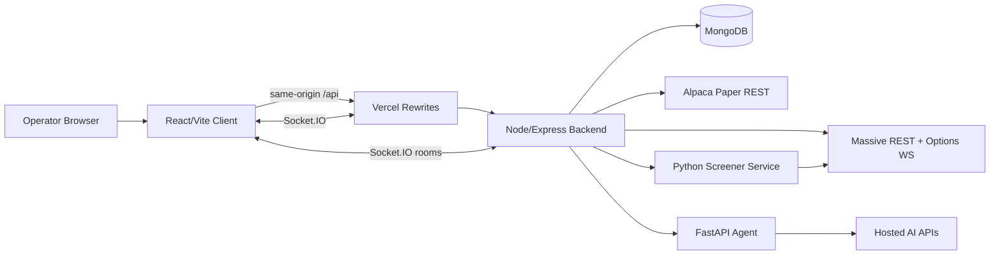
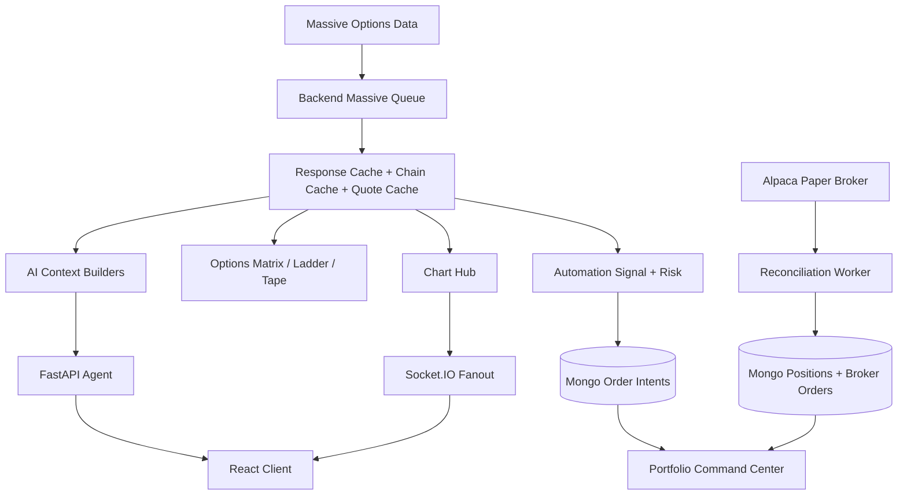
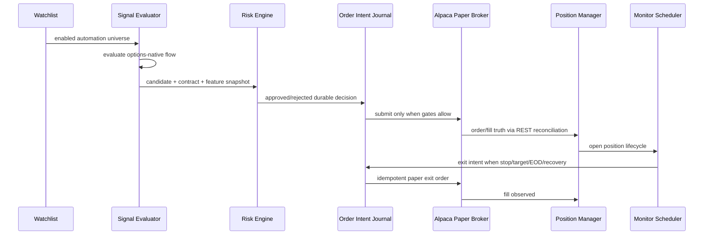

# AI-Trader Enterprise Strategy Engine Readiness Audit

Date: 2026-07-25
Baseline reviewed: `v1.1-enterprise-baseline`
Baseline commit: `b31f6c83d1136d9c5093034ae0be50e6b8b2caf3`
Scope: repository architecture audit only. No product features were implemented.

## Executive Summary

AI-Trader is production-stable for the certified v1.1 options-first paper-trading baseline. The platform has a coherent React/Vite client, Node/Express backend, MongoDB persistence layer, Massive market-data ownership, Alpaca paper broker integration, Socket.IO fanout, automation scheduler/monitor, portfolio command center, trading-intelligence records, and advisory FastAPI AI service.

The platform is ready to begin Strategy Engine foundation work: strategy contracts, event contracts, feature-store design, backtesting hardening, experiment tracking, retrieval/RAG research, and paper-only strategy research.

The platform is not yet architecturally ready for autonomous live-money execution, production reinforcement learning, direct AI execution authority, multi-account automation, unreviewed strategy self-modification, or GPU-required production execution.

Primary finding: the current bottleneck is not compute. The bottleneck is enterprise control architecture: identity, RBAC, durable eventing, replayable feature provenance, strategy lifecycle governance, experiment tracking, and deterministic promotion gates.

## Certification Baseline

The audit starts from the certified v1.1 baseline:

- Git branch: `main`
- Git commit: `b31f6c83d1136d9c5093034ae0be50e6b8b2caf3`
- Git tag: `v1.1-enterprise-baseline`
- Baseline certification docs:
  - `docs/release/PRODUCTION_CERTIFICATION.md`
  - `docs/release/ENTERPRISE_BASELINE.md`
  - `docs/architecture/ENTERPRISE_GROWTH_STRATEGY.md`

Certification evidence preserved in the repository states:

```text
npm run lint                          PASS
npm run build                         PASS
npm --prefix server test              PASS, 425 passed
npm --prefix client test              PASS, 138 passed
npm --prefix client run test:e2e      PASS, 31 passed / 1 skipped
npm --prefix client run test:e2e:prod PASS, 31 passed / 1 skipped
npm audit                             PASS, 0 vulnerabilities
npm --prefix client audit             PASS, 0 vulnerabilities
npm --prefix server audit             PASS, 0 vulnerabilities
Production aggregate health           GREEN
```

During this audit, `npm --prefix client test` passed on rerun but first surfaced an unhandled Vitest teardown/RPC error after all tests passed. That is classified as testing reliability debt, not evidence of a product regression.

## Current Architecture

AI-Trader v1.1 is an options-first, paper-trading platform with these runtime units:

- `client/`: React/Vite trading workstation with charts, options matrix, order ticket, watchlist, portfolio, cockpit, automation command center, system operations, health surfaces, AI desk, and trading intelligence views.
- `server/`: Node/Express API gateway and application core. Owns Massive credentials, market-data normalization, Socket.IO fanout, Mongo persistence, automation scheduling, broker adapter access, portfolio operations, health reporting, and AI proxying.
- `agent/`: FastAPI advisory AI service for analysis, strategy extraction, transcription, SIFT extraction, chat-compatible completions, and basic backtest response surfaces.
- `python-screener-service/`: FastAPI/Python screener and backtest service for 0DTE covered-call, iron-condor, lab backtest, screener backtest, and 0DTE universe scan endpoints.
- MongoDB Atlas/local Mongo: durable state for watchlists, automation records, order intents, broker orders, positions, conversations, strategy/lab records, reports, journals, and operational history.
- Massive: market-data provider under the current options-advanced entitlement boundary.
- Alpaca: paper broker truth for account, clock, orders, positions, fills, and reconciliation.
- Vercel: frontend hosting and same-origin rewrites.
- Render: backend and agent hosting.

## Current System Diagram



## Data-Flow Diagram



## Execution-Flow Diagram



## Current API Inventory

Node/Express gateway mounts:

| Mount | Responsibility |
| --- | --- |
| `/health`, `/api/health` | Basic backend health |
| `/api/system/health` | Composite subsystem health |
| `/api/market` | Aggregates, trades, quotes, option chains/contracts/selection, references, indicators, short-interest, short-volume |
| `/api/market-data` | Options market-data health and status |
| `/api/options` | Option selection persistence compatibility surface |
| `/api/broker` | Alpaca account, clock, option positions, option orders |
| `/api/trading/manual` | Manual intent create/confirm/submit boundary |
| `/api/automation` | Automation health, scheduler, sessions, reconciliation, candidates, selections, risk decisions, universe evaluations |
| `/api/portfolio` | Operations, positions, orders, automation visibility, timeline, trades, pause/resume/emergency stop, cancel/close |
| `/api/watchlist` | Watchlist and automation-universe source of truth |
| `/api/intelligence` | Trading sessions, trade reports, daily reports, decision journal, strategy analytics, admin-gated generation/backfills |
| `/api/agent` | FastAPI agent proxy and health |
| `/api/analyze` | Assistant analysis route |
| `/api/chat` | AI chat route |
| `/api/conversations` | Conversation persistence |
| `/api/lab` | Strategy lab CRUD, versions, AI review, extraction notifications |
| `/api/strategy` | Strategy parse, compile, extracted compile, backtest, versions |
| `/api/engine` | Engine demo strategies, trigger/status, screener hook |
| `/api/lab/futures`, `/api/engine/futures` | Futures contracts, backtest, stress test, paper runtime, promotion/deploy demo |
| `/api/handoff` | Handoff requests and approval |
| `/api/chart/health` | Chart health logs/stats |

Python Agent endpoints:

| Endpoint | Responsibility |
| --- | --- |
| `GET /health` | Agent health and commit |
| `GET /data/capitol-trades` | External context stub/fetch surface |
| `GET /data/fred-calendar` | Macro calendar context |
| `GET /data/earnings` | Earnings context |
| `POST /analyze` | Advisory analysis |
| `POST /extract-strategy` | Strategy extraction |
| `POST /extract-strategy-async` | Async strategy extraction |
| `POST /transcribe-audio` | Audio transcription |
| `POST /generate-strategy` | Code generation response |
| `POST /interpret-rules` | Rule interpretation |
| `POST /v1/chat/completions` | OpenAI-compatible chat surface |
| `POST /backtest` | Agent backtest response |

Python Screener endpoints:

| Endpoint | Responsibility |
| --- | --- |
| `GET /health` | Screener service health |
| `POST /api/screen/0dte-covered-calls` | 0DTE covered-call screen |
| `POST /api/screen/iron-condor` | Iron-condor screen |
| `POST /api/lab/backtest` | Lab backtest |
| `POST /api/lab/screener/backtest` | Screener backtest |
| `POST /api/scan/0dte-universe` | 0DTE universe scan |

Socket.IO events observed:

| Event family | Purpose |
| --- | --- |
| `live:subscribe`, `live:unsubscribe`, `live:quote`, `live:trade`, `live:trades`, `live:status`, `live:error` | Live market-data UI fanout |
| `chart:focus`, `chart:snapshot`, `chart:update`, `chart:error`, `chart:cleared` | Chart hub and aggregate fanout |
| `automation:visibility:subscribe`, `automation:visibility`, `automation:event`, `automation:visibility:error` | Automation command-center visibility |
| `futures:*` | Futures paper runtime updates |
| `strategy-extracted` | Lab extraction notifications |
| `screener_signal` | Screener/engine notifications |

Socket.IO is suitable for UI fanout. It is not a durable system of record and must not be treated as the canonical event architecture for Strategy Engine v2.

## Validation Evidence

Audit command evidence:

```text
git branch --show-current              main
git rev-parse HEAD                     b31f6c83d1136d9c5093034ae0be50e6b8b2caf3
git tag --points-at HEAD               v1.1-enterprise-baseline
npm audit                              0 vulnerabilities
npm --prefix client audit              0 vulnerabilities
npm --prefix server audit              0 vulnerabilities
npm run lint                           PASS
npm --prefix server test               PASS, 425 tests
npm --prefix client test               PASS on rerun, 138 tests
npm run build                          PASS
production /api/system/health          GREEN after agent health refresh
production /api/agent/health           ok
agent /health                          ok, final baseline commit
```

Production health sampled during the audit showed:

- Aggregate status: `GREEN`.
- Mongo, risk, automation, signalMode, submission, scheduler, monitor, heartbeat, broker, execution, Alpaca, Massive, queue, rateLimit, cache, watchlist, and websocket: `GREEN`.
- Runtime AI moved from `unknown` to `ok` after refreshing `/api/agent/health`, indicating a cached probe timing behavior rather than an agent outage.
- Broker runtime was `DEGRADED_REST` with `truthCurrent: true`, which is the certified paper REST fallback posture.

## Testing Results

Strengths:

- Broad server coverage: automation gates, data gates, risk, selection, scheduler, submission, ownership, lifecycle, monitor, exit recovery, broker lifecycle, market sessions, Massive retry/rate-limit behavior, options WS, security headers, symbol translation, intelligence reports, AI health, and chart hub.
- Broad client coverage: cockpit, command center, contracts, daily reports, decision journal, execution, market data UI/status, options math, order history, portfolio close, socket singleton, strategy analytics, trade reports, trading sessions, and watchlist hydration.
- Production Playwright covers desktop, tablet, iPhone 13, and iPhone SE across app shell, watchlist, options matrix/depth/tape, portfolio, automation, AI desk, and mobile viewport overflow.

Reliability risks:

- A first `npm --prefix client test` audit run had all 138 tests pass but exited nonzero with `EnvironmentTeardownError: [vitest-worker]: Closing rpc while "onUserConsoleLog" was pending`, attributed to `src/__tests__/commandCenter.test.tsx`. The rerun passed. Treat as high-priority test flake debt.
- Production Playwright is serialized for live hosted verification. That is correct for current evidence collection but not a substitute for load/concurrency testing.
- No dedicated production load/soak suite exists for Socket.IO fanout, Massive queue pressure, quote cache fanout, broker reconciliation, AI latency, or automation visibility.

## Technical Debt

Critical / High:

- Global authentication and RBAC are not yet a universal backend request-boundary requirement.
- Strategy concepts are fragmented across `automation`, `strategy`, `lab`, `engine`, `futures`, and Python screener services.
- Event architecture is in-process Socket.IO plus Mongo domain records, not a durable event log or transactional outbox.
- Automation is intentionally validated for exactly one concurrent autonomous position.
- Backtesting does not yet have a unified reproducible dataset/version/artifact contract for Strategy Engine promotion.
- Experiment tracking is not yet a first-class domain.
- Learning/RL foundations are not yet isolated behind offline, paper-only research controls.

Medium:

- Broad `any` usage remains in market, portfolio, dashboard, lab, and aggregation code.
- Mixed direct `console.*` logging and structured logging remain.
- `referenceUI/` prototype code is tracked in the production repository.
- `docs/reflection.md` contains raw working notes and confidential-looking transcript material; it should not be a canonical enterprise architecture source.
- Some docs contain stale paths or stale local-development variables.
- Docker-compose local client env uses `VITE_API_URL`, while the certified client standard is `VITE_API_BASE_URL` and production same-origin rewrites.

Low:

- UI polish and consistency can continue after core v2 controls are in place.
- GPU experimentation should not distract from architecture work.

## Code Smells

- Route files often accept `any` request/response payloads without shared schema validation.
- Some API surfaces are historical compatibility layers (`/api/options/selection` and `/api/market/options/selection`) and should eventually have canonical ownership.
- Strategy and lab versioning are not unified into one promotion model.
- Socket.IO events are useful but not traceable enough for replayable decision provenance.
- Some operational status fields are cached snapshots and must be carefully labeled to avoid misleading health claims.

## Security Assessment

Strengths:

- Production security middleware is configured with Helmet, CSP, frameguard, no `x-powered-by`, referrer policy, and HSTS in production.
- CORS is origin allowlist based.
- Safe structured logging redacts key/secret/token/password/authorization/credential/cookie fields.
- Broker execution boundary is explicit and deterministic.
- Manual trading uses durable confirmed intent, payload hashing, idempotency keys, and fail-closed infrastructure gates.
- Production mock broker is rejected by automation configuration.
- Admin-gated intelligence generation/backfills require `INTELLIGENCE_ADMIN_TOKEN`.
- NPM audits are clean.
- No tracked `.env` files or obvious high-entropy secret patterns were found in the working tree audit.

## Authentication and RBAC Gaps

Before Strategy Engine can govern production trading, the platform needs:

- Global authentication middleware for backend routes.
- Authenticated session identity on every request and state mutation.
- Explicit roles: viewer, trader, operator, administrator.
- Route-level authorization for watchlist writes, broker reads/writes, manual trading, automation controls, strategy/lab mutations, engine triggers, handoff approvals, and intelligence generation.
- Actor attribution in every durable event and every audit record.
- Account isolation for users, watchlists, strategy runs, order intents, positions, journals, and AI requests.
- Replay prevention and consistent idempotency for all state-changing endpoints.
- CSRF policy for browser-origin state changes if cookie/session auth is introduced.
- Secret scanning in CI and documented credential rotation evidence.
- Live-trading prohibition enforcement independent of UI controls.

## Performance Assessment

Strengths:

- Massive request manager has priorities, cache, in-flight dedupe, rate-limit cooldown, entitlement blocks, retry/backoff, and metrics.
- Options chain orchestrator narrows provider calls using expiration/type/strike windows.
- Options live data is backend-owned and refcounted through a shared options subscription manager.
- Production bundle size is acceptable for the current workstation. Largest observed raw JS chunk was the chart vendor chunk around 449 KB before compression.
- AI calls have process-level rate limits, daily limits, and concurrency caps.

Risks:

- In-memory caches and queues are process-local.
- Horizontal scale requires either sticky routing, shared cache, external queue, or explicit single-owner process roles.
- Socket.IO through Vercel same-origin long polling is production-stable but not an enterprise load design.
- No steady production resource budgets are enforced for memory, CPU, queue depth, AI latency, broker latency, or provider fanout.

## Scalability Assessment

The platform can scale carefully within the current single-backend baseline. It is not yet ready for multi-service, multi-account, multi-strategy, multi-position production automation.

Required before scale-out:

- Durable outbox/event log.
- Shared event/feature contracts.
- Account-scoped state.
- Externalized queue or worker ownership model.
- Feature-store and backtest dataset versioning.
- Load tests around market data fanout and automation visibility.
- Clear broker adapter interface and paper/live environment separation.

## Documentation Drift

Observed drift:

- `docker-compose.yml` uses `VITE_API_URL`, but current certified client config uses `VITE_API_BASE_URL`.
- `docs/api-reference.md` references `server/src/services/aggregatesWorker.ts`; implementation uses `server/src/features/market/services/aggregatesWorker.ts`.
- `docs/AGENT_ARCHITECTURE.md` states the frontend handles user authentication; repository evidence does not show a global production auth/RBAC layer.
- `docs/reflection.md` contains raw strategy/architecture notes and should not be treated as canonical.

Recommendation: keep v1.1 certification docs unchanged, but create a canonical v2 architecture document with traceability and governance so future agents do not treat scattered notes as implementation authority.

## Massive Entitlement Assumptions

The audit assumes only current entitlements:

- Massive Advanced Options Market Data.
- Existing chart endpoints and APIs already integrated.
- No premium real-time equity feed.
- No required current-day stock intraday aggregates.
- No direct browser access to Massive credentials.

Currently implemented or verified Massive usage:

- Options chains.
- Options contracts/reference metadata.
- Options snapshots.
- Quotes.
- Trades.
- Greeks.
- Implied volatility.
- Open interest.
- Volume.
- Bid/ask spreads and day stats.
- Market status.
- Authorized aggregates where available.
- News/sentiment/context where provider data is available.
- Short-interest and short-volume context for equity risk framing.

Every v2 feature must carry provider source, entitlement status, timestamp, freshness, calculation version, missing-data behavior, and quality status.

## Strategy Engine Readiness Matrix

| Capability | Readiness | Missing / Risk | Rank |
| --- | --- | --- | --- |
| Strategy Engine | Partial | Unified strategy contract, lifecycle, version promotion, feature dependencies, promotion gates | Critical |
| Signal Engine | Partial | Signal registry, feature provenance, confidence calibration, multi-signal conflict handling | High |
| Risk Engine | Good for single paper position | Multi-position, portfolio, correlation, assignment/exercise, account-level risk | High |
| Position Manager | Partial | Multi-position, complex options, assignment/exercise, account isolation | High |
| Order Manager | Partial | Paper only; live controls, broker streaming, order-state event contract incomplete | Critical |
| Portfolio Manager | Partial | Account-scoped exposure, attribution, risk views, multi-strategy attribution | High |
| Trade Journal | Partial | Intelligence records exist; needs complete automatic lifecycle and replayable links | Medium |
| Learning Engine | Not ready | Feature history, labels, reward candidates, offline-only guardrails | Critical |
| Backtesting | Partial | Dataset versions, slippage/commission models, walk-forward validation, artifacts | High |
| Paper Trading | Ready baseline | Single-position only; expand carefully | Medium |
| Live Trading | Not ready | Auth, RBAC, compliance, live broker certification, kill-switch drills | Critical |
| Reinforcement Learning | Not ready | Offline sandbox, reward model, anti-overfit controls; no production path | Critical |
| Strategy Versioning | Partial | Existing models fragmented; needs canonical lifecycle and rollback | High |
| Experiment Tracking | Not ready | Run IDs, datasets, metrics, artifacts, lineage, promotion/rejection records | High |

## Signal Engine Readiness

Current options-native signal logic is a reasonable seed for v2 but should not become the final Strategy Engine contract unchanged. It needs:

- Formal signal input schema.
- Required feature declarations.
- Signal output schema with confidence, direction, reason codes, and data-quality state.
- Versioned calculation logic.
- Support for multiple signals without implicit priority conflicts.
- Replay behavior against historical feature windows.

## Risk Engine Readiness

Current risk gates are strong for the certified single-position paper baseline. They include deterministic sizing, max concurrent position guard, daily loss limits, market clock checks, stale-data rejection, and broker truth freshness.

Missing for v2:

- Portfolio-level risk.
- Multi-position risk.
- Correlation/exposure risk.
- Per-strategy and aggregate daily risk.
- Assignment/exercise risk for options.
- Risk-decision event schema.
- Human override governance.

## Position and Order Manager Readiness

Current position/order lifecycle supports paper entry, reconciliation, open position monitoring, exits, emergency stop, EOD flattening, and overnight recovery.

Missing for v2:

- Canonical order-state machine.
- Durable order events.
- Account isolation.
- Multi-position lifecycle validation.
- Partial-fill and complex-order lifecycle across strategies.
- Broker adapter contracts for future brokers.
- Live-money certification controls.

## Portfolio Manager Readiness

The portfolio command center aggregates useful operations state and broker/automation context. It is ready as an operator surface for paper trading.

Missing for v2:

- Strategy-level attribution.
- Account-level exposure.
- Risk-adjusted performance.
- Full P&L lineage from fill to journal to analytics.
- Multi-account isolation.

## Trade Journal Readiness

Trading intelligence records exist for sessions, trades, daily reports, decisions, and strategy analytics. This is a strong foundation.

Missing for v2:

- Automatic journal linkage to every durable event.
- Required evidence snapshot for every decision.
- Human feedback capture.
- Strategy version and feature version lineage.
- Complete outcome labeling for learning datasets.

## Learning Engine Readiness

Not production-ready. The platform should build the data foundation but not deploy adaptive learning into execution.

Required first:

- Historical features.
- Signals.
- Risk decisions.
- Orders.
- Fills.
- Outcomes.
- Human feedback.
- Experiment runs.
- Reproducible datasets.
- Strict offline/paper-only controls.

## Backtesting Readiness

Partial. There are backtest surfaces and tests, but v2 needs reproducible, point-in-time-correct backtesting:

- Dataset IDs and versions.
- Feature versions.
- Strategy versions.
- Configuration snapshots.
- Commission and slippage models.
- Liquidity assumptions.
- Walk-forward and out-of-sample validation.
- Naive baseline comparisons.
- Artifact persistence.
- Promotion/rejection criteria.

## Paper-Trading Readiness

The certified baseline is ready for controlled paper-trading foundation work. v2 should remain paper-only while the Strategy Engine foundation is built.

Allowed:

- Paper-only Strategy Engine contracts.
- Simulation.
- Backtesting.
- Experiment tracking.
- RAG assistance.
- Operator-reviewed strategy promotion.

Not allowed:

- Live-money automation.
- Autonomous AI strategy mutation.
- Production RL execution.

## Live-Trading Blockers

Live trading is blocked until:

- Global auth and RBAC are implemented.
- Account isolation exists.
- Every state change is actor-attributed.
- Live broker adapter certification is completed.
- Compliance and operational review are completed.
- Kill-switch drills are tested.
- Production incident runbooks exist.
- Load/soak tests pass.
- Strategy promotion gates are deterministic and human-approved.
- AI and RL are explicitly barred from direct execution authority.

## Reinforcement-Learning Blockers

RL must remain offline research because:

- Reward design is not defined.
- Dataset and environment versioning are not defined.
- Backtest overfitting risk is high.
- Walk-forward validation is not yet mandatory.
- There is no paper-only RL sandbox with promotion prohibition.
- RL can create hidden behavior that is difficult to explain and audit.

## Strategy-Versioning Readiness

Partial. Strategy/lab models exist, but v2 requires a canonical strategy lifecycle:

- Draft.
- Backtest.
- Approved for simulation.
- Approved for paper trading.
- Paused.
- Rejected.
- Retired.
- Rollback.

Each strategy version must declare required features, signal logic, risk requirements, entry/exit rules, sizing policy, explainability output, performance attribution, and promotion gates.

## Experiment-Tracking Readiness

Not ready as a first-class domain. v2 needs:

- Experiment run IDs.
- Dataset versions.
- Feature versions.
- Strategy versions.
- Configuration snapshots.
- Random seeds.
- Metrics.
- Artifacts.
- Baselines.
- Promotion/rejection outcome.
- Human reviewer.
- Reproducibility status.

## Recommended Module Architecture

Recommended future structure:

```text
server/src/domains/
  market-data/
  feature-store/
  strategy-engine/
  signal-engine/
  risk-engine/
  execution/
  broker-adapters/
  portfolio/
  position-manager/
  order-manager/
  trade-journal/
  backtesting/
  experiment-tracking/
  learning-dataset/
  ai-retrieval/
  operations/
  auth/
  observability/
  shared/
```

This is a target ownership model, not an instruction to refactor immediately.

## Recommended Durable Event Architecture

Begin with a Mongo-backed transactional outbox or equivalent durable event log before introducing Kafka, NATS, or another event platform.

Minimum events:

- `MarketSnapshotIngested`
- `FeatureCalculated`
- `StrategyEvaluationStarted`
- `SignalGenerated`
- `RiskDecisionMade`
- `OrderIntentCreated`
- `OrderIntentApproved`
- `OrderSubmitted`
- `FillObserved`
- `PositionOpened`
- `ExitTriggered`
- `PositionClosed`
- `JournalEntryCreated`
- `BacktestStarted`
- `BacktestCompleted`
- `ExperimentCompleted`
- `DatasetVersionCreated`
- `StrategyPromoted`
- `StrategyPaused`
- `EmergencyStopActivated`

Each event requires:

- Event ID.
- Event version.
- Aggregate ID.
- Correlation ID.
- Causation ID.
- Actor ID.
- Strategy ID.
- Strategy version.
- Account ID.
- Timestamp.
- Payload schema.
- Idempotency behavior.
- Retention policy.
- Replay behavior.

## Recommended AI Authority Boundaries

AI may:

- Summarize evidence.
- Retrieve relevant docs, news, filings, journal history, and strategy history.
- Propose changes.
- Explain signals, risk decisions, and outcomes.
- Generate draft strategy definitions.
- Assist with post-trade analysis.

AI may not:

- Submit orders.
- Modify strategy/risk/execution rules directly.
- Promote a strategy.
- Override risk controls.
- Clear emergency stops.
- Operate live-money paths.
- Execute reinforcement-learning policies in production.

## 30-, 60-, and 90-Day Roadmap

### Days 1-30

- Preserve audit reports and canonicalize v2 architecture.
- Add architecture decision records for paper-only strategy foundation, AI authority, outbox, Massive entitlement boundary, optional GPU, CPU-served retrieval, deterministic promotion, and offline RL.
- Define global auth and RBAC plan.
- Define durable event and strategy contracts.
- Stabilize client Vitest teardown flake.
- Correct documentation drift.

### Days 31-60

- Implement auth/RBAC foundation.
- Implement Mongo durable outbox.
- Define feature schema and provenance.
- Build reproducible backtest dataset/version model.
- Consolidate strategy/lab version model into canonical contract.
- Add experiment-tracking domain design and initial records.
- Add load/soak test plan for market-data and automation fanout.

### Days 61-90

- Integrate paper-only Strategy Engine behind gates.
- Add feature-store ingestion for Massive options data.
- Add paper-only experiment promotion workflow.
- Add trade-journal event linkage and learning dataset snapshots.
- Prototype RAG/semantic retrieval as optional advisory support.
- Add multi-strategy simulation only after eventing and experiment tracking exist.

## Priority Matrix

| Priority | Work |
| --- | --- |
| Critical | Global auth/RBAC, durable events, unified strategy contract, live-trading prohibition, AI no-order-authority, offline-only RL boundary |
| High | Feature store, backtest reproducibility, experiment tracking, strategy/version consolidation, test flake cleanup, multi-position design |
| Medium | Docs drift cleanup, typed route schemas, console logging cleanup, load/soak suites, reference/prototype repository cleanup |
| Low | GPU experimentation, UI polish beyond certified workflows, future local LLM research |

## Definition of Architectural Readiness

AI-Trader is architecturally ready for Strategy Engine implementation only when:

- Every strategy has a versioned contract.
- Every feature is versioned, timestamped, source-attributed, freshness-scored, and replayable.
- Every strategy evaluation emits durable events.
- Every signal, risk decision, order intent, order submission, fill, position transition, and journal entry is attributable and replayable.
- Every state-changing request has authenticated actor identity and RBAC enforcement.
- Backtests are reproducible with dataset IDs, feature versions, strategy versions, config snapshots, slippage, commission, and baseline comparisons.
- Experiment tracking records metrics, artifacts, lineage, and promotion/rejection outcomes.
- Strategy promotion requires deterministic evidence and human approval.
- Paper trading remains the only allowed execution mode for v2 foundation.
- Live-money automation remains explicitly prohibited.
- AI and RL have no direct execution authority.
- GPU services are optional research/indexing infrastructure and are not required for production operation.

## Final Audit Conclusion

The application is production-stable for the certified paper-trading baseline. It is ready for v2 architecture foundation work. It is not ready for autonomous live-money execution or production reinforcement learning.
