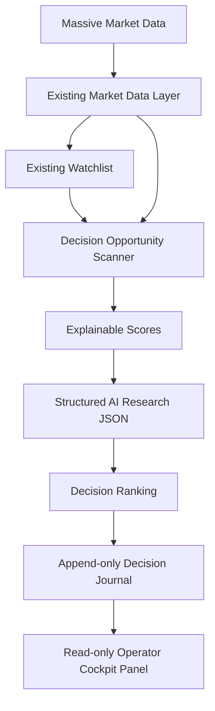
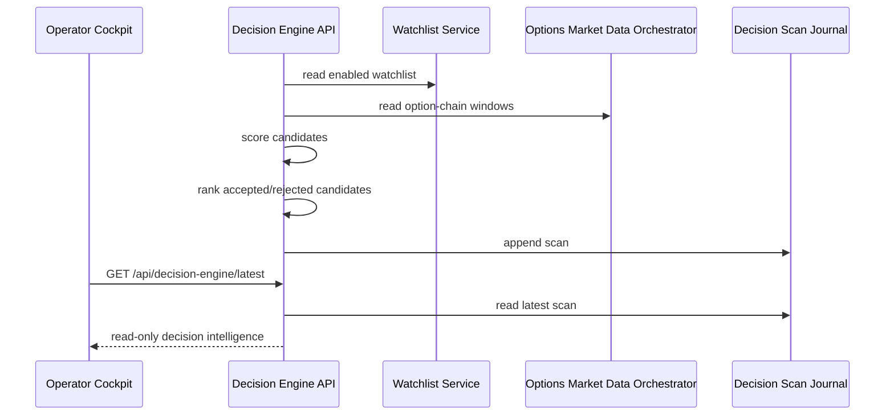

# Decision Intelligence Engine

## Architecture

The Decision Intelligence Engine is an additive intelligence layer between the
existing market-data/watchlist systems and execution. It does not submit orders,
route broker calls, or mutate automation execution state.



## Sequence



## Data Flow

Inputs:

- Existing watchlist symbols and thresholds
- Option-chain contracts
- Bid, ask, spread, volume, open interest, IV, and Greeks when supplied
- Market status and delayed underlying context labels
- Optional news, sector, and market breadth context

Outputs:

- Candidate opportunities
- Explainable scores
- Structured research JSON
- Top 10 ranking
- Rejected candidates with machine reason codes and human explanations
- Append-only scan journal records

## JSON Schemas

Candidate score:

```json
{
  "key": "liquidity",
  "score": 86.2,
  "maxScore": 100,
  "grade": "STRONG",
  "explanation": "Higher volume and open interest improve fills.",
  "inputs": {
    "volume": 1200,
    "openInterest": 2500
  }
}
```

Research output:

```json
{
  "symbol": "SPY",
  "contract": "O:SPY260821C00500000",
  "confidence": 0.82,
  "bullishReasons": [
    "Candidate is a call contract, so its payoff direction is bullish."
  ],
  "bearishReasons": [],
  "risks": [],
  "marketContext": {
    "marketStatus": "open",
    "underlyingPrice": 501.25,
    "underlyingTimeframe": "DELAYED",
    "sector": null,
    "marketBreadth": null,
    "news": [],
    "trend": "UNKNOWN",
    "momentum": "UNKNOWN"
  },
  "expectedMove": {
    "source": "SUPPLIED_IV",
    "value": 0.0514,
    "explanation": "Uses supplied IV and DTE only."
  },
  "recommendation": "BUY_CALL",
  "explanation": "The contract clears explainable gates."
}
```

## Reason Codes

- `LOW_VOLUME`: supplied contract volume is below threshold.
- `HIGH_SPREAD`: bid/ask spread is too wide.
- `LOW_CONFIDENCE`: explainable confidence is below threshold.
- `POOR_RISK_REWARD`: risk/reward does not justify the setup.
- `HIGH_IV`: supplied IV is above threshold.
- `LOW_OPEN_INTEREST`: open interest is below threshold.
- `MARKET_CLOSED`: market status is not open.
- `BUYING_POWER`: position-size policy cannot be satisfied.
- `DATA_UNAVAILABLE`: required data is missing.
- `INCOMPLETE_CHAIN`: option-chain pagination was incomplete.
- `STALE_QUOTE`: quote freshness failed.
- `NO_BID_ASK`: bid or ask was not supplied.
- `LOW_LIQUIDITY`: liquidity score is weak.
- `WEAK_TREND`: trend context does not support the contract.
- `WEAK_MOMENTUM`: momentum evidence is weak.
- `ELEVATED_RISK`: risk score failed after spread, IV, delta, and theta
  checks.

## API

- `GET /api/decision-engine/latest`: latest journaled scan.
- `GET /api/decision-engine/scans?limit=50`: scan history.
- `GET /api/decision-engine/scans/:scanId`: replay a scan.
- `POST /api/decision-engine/scan`: run and append a live scan. No execution.
- `POST /api/decision-engine/validate`: validate supplied scan input without
  persisting.

## Operation

Set `DECISION_ENGINE_AUTO_START=true` to run the scanner continuously on the
server interval. The default is off to avoid unexpected provider load during
local development.
