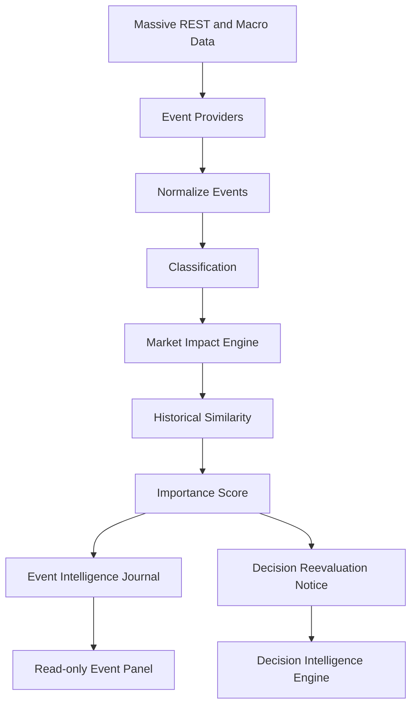
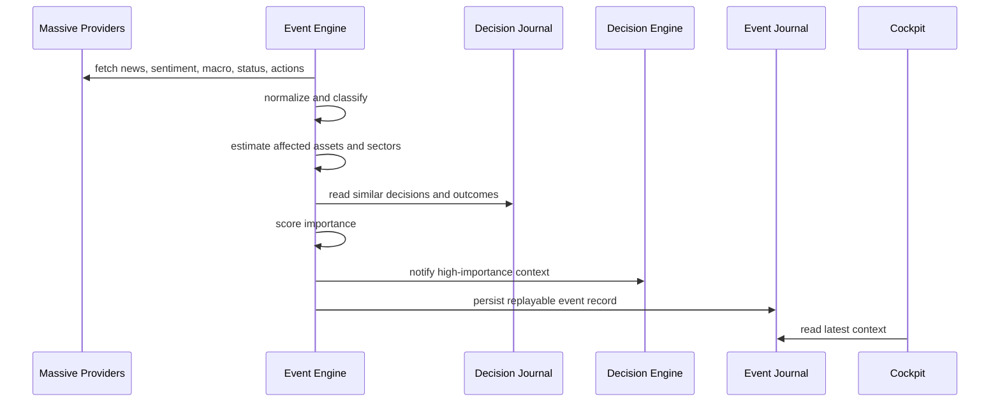

# Event Intelligence Engine

## Architecture

The Event Intelligence Engine is an additive market-awareness layer. It reads
market events, classifies them, estimates impact, stores replayable context, and
notifies the Decision Intelligence Engine when reevaluation is justified.

It never places orders and never calls the execution gateway.



## Sequence



## Provider Documentation

Local Massive references reviewed:

- `docs/massive/README.md`
- `docs/market-data/options-advanced-alignment-audit.md`
- `docs/ai-features.md`
- `server/src/shared/data/massiveMacro.ts`
- `server/src/features/options/services/optionsChecklist.ts`

Integrated through existing infrastructure:

- News and company news: `/v2/reference/news`
- Market news: `/v2/reference/news` without a ticker filter
- Sentiment: `/v1/sentiment/{symbol}`
- Market status: existing `getMarketStatusSnapshot`
- Economic events: `/fed/v1/treasury-yields`, `/fed/v1/inflation`,
  `/fed/v1/labor-market`
- Earnings-style records: best-effort `/vX/reference/financials`
- Corporate actions: best-effort `/v3/reference/dividends` and
  `/v3/reference/splits`

All calls reuse `massiveGet`, existing API key handling, rate limiting,
request priority, cache, retry, and entitlement cooldown behavior.

## JSON Schemas

Normalized event:

```json
{
  "id": "massive-market-news:abc123",
  "provider": "massive-market-news",
  "timestamp": "2026-07-25T14:00:00.000Z",
  "title": "Iran ceasefire sends crude oil lower",
  "summary": "Energy markets react.",
  "category": "Oil",
  "sentiment": {
    "label": "bullish",
    "score": 0.91,
    "explanation": "Provider or keyword sentiment."
  },
  "symbols": ["OXY"],
  "sectors": ["Energy"],
  "confidence": 0.85,
  "importance": 95,
  "importanceExplanation": "Component scoring explanation.",
  "source": "Massive",
  "url": null,
  "raw": {}
}
```

Impact estimate:

```json
{
  "affectedSymbols": ["CVX", "OXY", "USO", "XLE", "XOM"],
  "affectedEtfs": ["USO", "XLE"],
  "affectedSectors": ["Energy"],
  "affectedCommodities": ["Oil"],
  "confidence": 0.91,
  "importance": 95
}
```

## Classification Rules

Classification is deterministic and keyword based. Examples:

- Federal Reserve: `fed`, `fomc`, `powell`
- Economic: `inflation`, `cpi`, `payroll`, `treasury yield`
- Oil: `oil`, `crude`, `opec`, `ceasefire`
- AI and Technology: `ai`, `gpu`, `semiconductor`, `cloud`
- Corporate actions: dividends, splits, and financial reference records
- Analyst events: upgrade, downgrade, price target changes

## Scoring

Importance is 0-100 and explained from:

- Recency
- Provider source
- Sentiment magnitude
- Market impact breadth
- Historical similarity
- Sector breadth
- Affected symbols, ETFs, and commodities
- Event category
- Confidence

High-importance events notify the Decision Intelligence Engine with event
context only. The Decision Engine may rescore opportunities; no order is passed.

## API

Read-only endpoints:

- `GET /api/event-intelligence/events`
- `GET /api/event-intelligence/latest`
- `GET /api/event-intelligence/history`
- `GET /api/event-intelligence/symbol/:ticker`
- `GET /api/event-intelligence/sector/:sector`
- `GET /api/event-intelligence/context`

## Example

Iran ceasefire:

- Category: `Oil`
- Affected commodity: `Oil`
- Affected ETFs: `USO`, `XLE`
- Affected symbols: `CVX`, `OXY`, `XOM`
- Affected sector: `Energy`
- Decision trigger: high-importance reevaluation notice
- Execution: none
