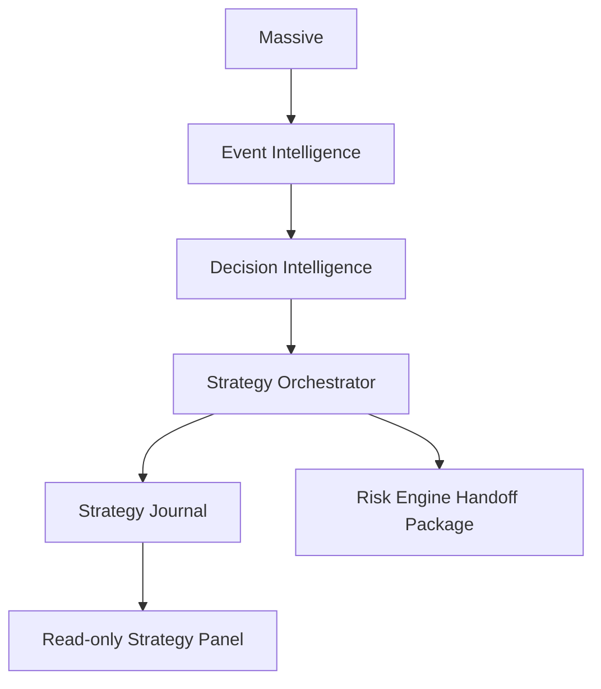

# Strategy Orchestrator

## Architecture

The Strategy Orchestrator is the central recommendation layer between Decision
Intelligence and the Risk Engine. It selects relevant strategies, evaluates
evidence, resolves disagreement, and emits a recommendation package.

It does not approve trades and does not execute orders.



## Strategy Lifecycle

1. Build context from event intelligence, decision intelligence, watchlist,
   persisted portfolio state, news, sentiment, technical scores, and regime.
2. Detect market regime.
3. Schedule only strategies relevant to current events/regime.
4. Evaluate independent strategy modules.
5. Aggregate evidence into a 0-100 evidence score.
6. Rank all strategies.
7. Resolve conflicts.
8. Produce recommendation: `BUY`, `WATCH`, `WAIT`, `SKIP`, or `NO_TRADE`.
9. Append the run to the strategy journal.

## Evidence Model

Evidence combines:

- Event Intelligence
- Decision Intelligence
- Market data context
- Persisted portfolio context
- Watchlists
- News
- Sentiment
- Technical analysis
- Market regime

Every evidence score includes component values and an explanation.

## Conflict Resolution

Strategies may disagree. The orchestrator keeps the disagreement visible:

- Bullish strategies
- Bearish strategies
- Neutral strategies
- Confidence adjustment
- Recommended action
- Human-readable explanation

Conflicts usually downgrade `BUY`/`WATCH` to `WAIT`.

## JSON Schemas

Strategy evaluation:

```json
{
  "strategyId": "oil-commodity",
  "name": "Oil / Commodity",
  "direction": "BULLISH",
  "confidence": 0.82,
  "risk": 0.31,
  "expectedReturn": 0.58,
  "positionSize": 0.07,
  "evidenceScore": 88,
  "reasoning": ["Oil event fit is 90.0%."],
  "rejected": false,
  "rejectionReason": null
}
```

Recommendation package:

```json
{
  "action": "WATCH",
  "confidence": 0.74,
  "supportingStrategies": [],
  "rejectedStrategies": [],
  "riskHandoff": {
    "allowedForRiskReview": true,
    "message": "Risk Engine must independently approve.",
    "packageId": "uuid"
  }
}
```

## API

Read-only endpoints:

- `GET /api/strategy-orchestrator/status`
- `GET /api/strategy-orchestrator/recommendations`
- `GET /api/strategy-orchestrator/strategies`
- `GET /api/strategy-orchestrator/history`
- `GET /api/strategy-orchestrator/evidence`

## Examples

Fed event:

- Scheduled: Fed Reaction, Macro Rotation, AI Consensus
- Skipped: Oil / Commodity
- Recommendation: watch or wait for Risk Engine review

Oil event:

- Scheduled: Oil / Commodity, Sector Rotation, News Momentum
- Portfolio adjustment: reduce confidence if Energy exposure is already high
- Recommendation package only; no execution path is called
